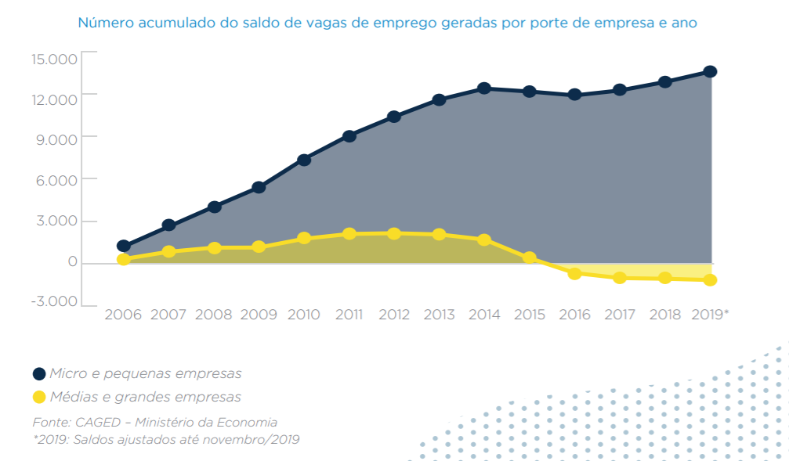
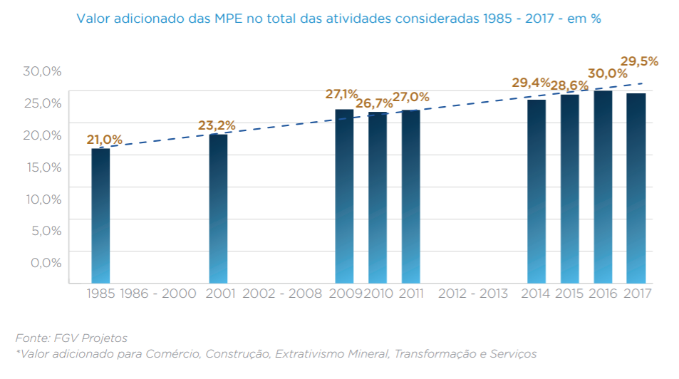
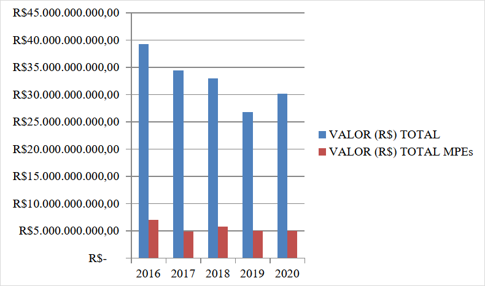
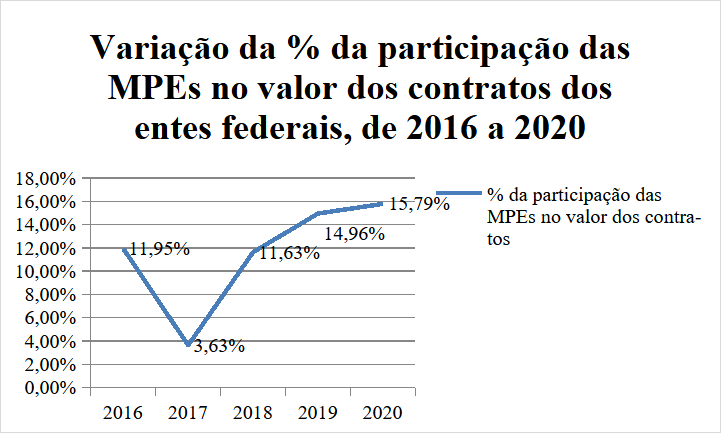
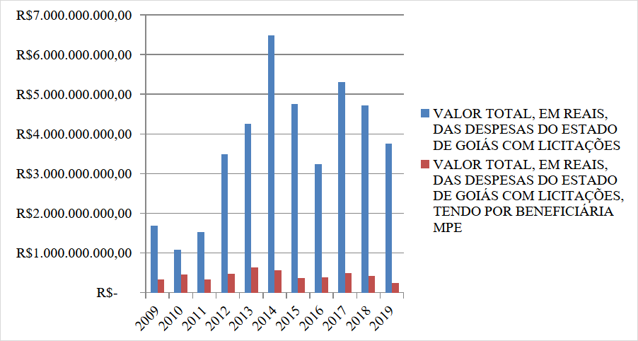
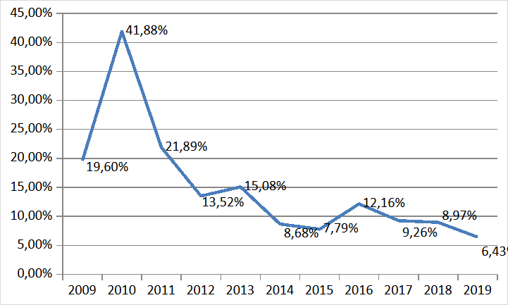
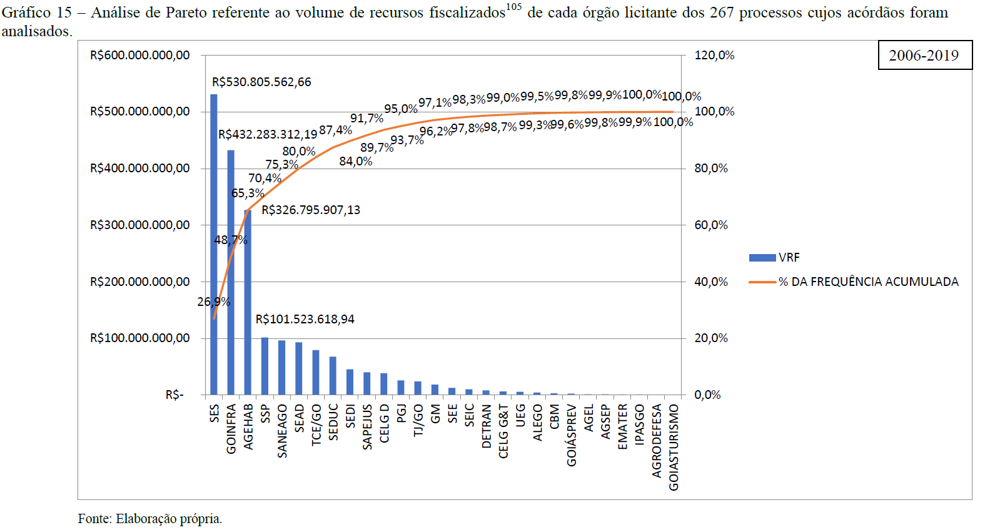
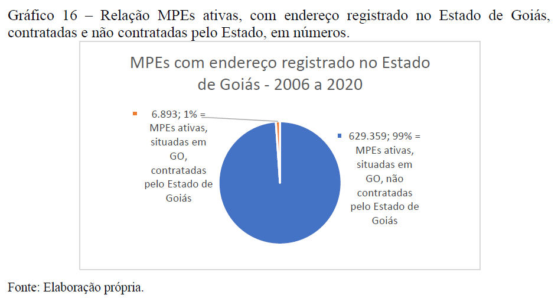

# AED - Replicar dados MPE compras públicas {#sec-replicar-dados-MPE}

Fonte pesquisa para essa replicação foi [@Barzellay2022-ppfmpe].

## Correlação: micro e pequena empresas

Carregar pacotes e set up.

```{r}

# import MASS first because it otherwise will mask dplyr::select
library(MASS)

library(tidyverse)
library(ggdendro)
library(psych)
library(gplots)
library(pdist)
library(factoextra)
library(viridis)
library(mclust)
library(knitr)

theme_set(theme_minimal())
```

Carregar dados primários e secundários coletados por [@Barzellay2022-ppfmpe].

### Importar

```{r}

# Importar como tibble o arquivo de dentro da pasta chamada: dat/csv.
mpe <- readr::read_csv(file   = "dat/csv/MPE-GO_DP_PIB_Caged_Rais.csv",
                       # delim  = ",",
                       quote  = "\"",
                       locale = locale(
                         decimal_mark = ".",
                         encoding     = "UTF-8"
                         )
                       )

# cat - Concatenate And Print
cat("\n") # imprime no console (saída) uma linha em branco
cat("Estrutura do objeto R denominado mpe:\n")
str(mpe)

cat("\n")
cat("Nomes das 8 colunas do objeto mpe:\n")
names(mpe)
# [1] "ano"  "PgtoGO_MPE"  "PIB"  "CAGED"  "RAIS"  "Pop"  "DPGO_MPE_pc"  "PIB_pc"
# ano: vai de 2006 até 2019 (14 linhas de observações para as 8 colunas de variáveis)

mpe # tibble: 14 × 8
```

### Dicionário de Dados

O significado das 8 variáveis coletadas neste Estudo Observacional de 267 do TCE-GO: o Poder das compras públicas pelo Estado de Goiás como instrumento de Política Pública de fomento às MPE's - Micro e Pequenas Empresas (art. 179, CF/1988; arts. 44 e 45, [LC n. 123/2006](https://www.planalto.gov.br/ccivil_03/leis/lcp/lcp123.htm) - Estatuto Nacional da Microempresa e da Empresa de Pequeno Porte).[^replicar-mpe-dados--correlacao-1]

[^replicar-mpe-dados--correlacao-1]: Art. 44. Nas licitações será assegurada, como critério de desempate, ***preferência de contratação para as microempresas e empresas de pequeno porte***. (Vide Lei nº 14.133, de 2021)

    § 1º Entende-se por ***empate*** aquelas situações em que as ***propostas apresentadas pelas microempresas e empresas de pequeno porte sejam iguais ou até 10% (dez por cento) superiores à proposta mais bem classificada***.

    § 2º Na modalidade de ***pregão***, o intervalo percentual estabelecido no § 1º deste artigo será de ***até 5% (cinco por cento) superior ao melhor preço***.

    Art. 45. Para efeito do disposto no art. 44 desta Lei Complementar, ocorrendo o ***empate***, proceder-se-á da seguinte forma: (Vide Lei nº 14.133, de 2021

    I - a ***microempresa ou empresa de pequeno porte mais bem classificada poderá apresentar proposta de preço inferior àquela considerada vencedora do certame***, situação em que será ***adjudicado em seu favor o objeto licitado***;

    II - ***não*** ocorrendo a ***contratação da microempresa ou empresa de pequeno porte***, na forma do ***inciso I*** do caput deste artigo, serão ***convocadas as remanescentes que porventura se enquadrem na hipótese dos §§ 1º e 2º do art. 44*** desta Lei Complementar, na ***ordem classificatória***, para o exercício do ***mesmo direito***;

    III - no caso de ***equivalência dos valores*** apresentados pelas microempresas e empresas de pequeno porte que se encontrem nos intervalos estabelecidos nos §§ 1º e 2º do art. 44 desta Lei Complementar, será ***realizado sorteio*** entre elas para que ***se identifique aquela que primeiro poderá apresentar melhor oferta***.

    § 1º Na hipótese da ***não-contratação*** nos termos previstos no caput deste artigo, o ***objeto licitado será adjudicado*** em ***favor da proposta originalmente vencedora*** do certame.

    § 2º O disposto neste artigo ***somente se aplicará quando a melhor oferta inicial não tiver sido apresentada por microempresa ou empresa de pequeno porte***.

    § 3º No caso de ***pregão***, a *microempresa ou empresa de pequeno porte mais bem classificada será convocada* para apresentar ***nova proposta no prazo máximo de 5 (cinco) minutos após o encerramento dos lances***, sob ***pena de preclusão***.

1.  "`ano`" - vai de 2006 até 2019 (são 14 linhas de observações para as 8 colunas de variáveis)

2.  "`PgtoGO_MPE`" - Despesas anuais do Estado de Goiás com MPE - Micro e Pequenas Empresas [@Barzellay2022-ppfmpe , p. 144, tabela 12], obtido do Sistema SIOFNet - Sistema de Elabroação e Execução Orcamentária e Financeira do Estado de Goiás.

3.  "`PIB`" - Produto Interno Bruto do Esatado de Goiás, obtido junto ao IMB - Instituto Mauro Borges;

4.  "`CAGED`" - Cadastro Geral de Empregados e Desempregados, obtido junto ao IMB - Instituto Mauro Borges, que fornece o ***saldo anual*** de empregos, ou seja, Contratações - Demissões [@Barzellay2022-ppfmpe , p. 155];

5.  "`RAIS`" - Relação Anual de Informações Sociais, obtido junto ao IMB - Instituto Mauro Borges, que fornece o ***número total*** de ***vínculos empregatícios*** ano a ano [@Barzellay2022-ppfmpe , p. 154-155];

6.  "`Pop`" - População do Estado de Goiás, \[obtido junto ao IMB - Instituto Mauro Borges\];

7.  "`DPGO_MPE_pc`" - Despesas anuais *per capta* do Estado de Goiás com MPE - Micro e Pequenas Empresas, calculada, ano a ano, de 2006 a 2019, pela seguinte fórmula:

    $$
    DPGO\_MPE\_pc = \frac{PgtoGO\_MPE}{Pop}
    $$

8.  "`PIB_pc`" - Produto Interno Bruto *per capta* do Esatado de Goiás, calculado, ano a ano, de 2006 a 2019, pela seguinte fórmula:

    $$
    PIB\_pc = \frac{PIB}{Pop}
    $$

### Contexto dos dados

A figura a seguir ilustra o contexto em que se deve interpretar os dados sobre CAGED e a MPE's no Brasil [@Barzellay2022-ppfmpe , p. 100].

{fig-align="center"}

Observe-se que, mesmo em príodo de ***crise*** de *empregos*, 2015 a 2019, as MPE's - Micro e Pequenas Empresas são *menos afetadas* e *tendem* a sofrer ***quedas não tão acentuadas*** e mesmo ***recuperar-se mais rapidamente*** que as empresas dos demais portes (médias e grandes).

Outro aspceto relevante é a participação das MPEs no PIB Brasil (1985-2017), conforme estudo realizado pela FGV e SEBRAE.

{fig-align="center"}

Percebe-se pouca dispersão em torno da reta tracejada (provável reta de regressão), que representa uma ***correlação positiva*** entre a **proporção** **(%) da participação** das MPE's no PIB-Br ao longo do período observados, de 1985 a 2017, de forma ***consistente*** ao longos desses **32 anos**.

Agora vamos olhar para os ***Valores***, em reais (R\$), da ***participação das MPEs beneficiárias de contratos nas compras públicas*** (licitações) de ***entes federais***, de 2016 a 2020 [@Barzellay2022-ppfmpe , p. 107, gráfico 2].



E verificar como a ***proporção (%) dessa participação evoluiu*** nesse mesmo período de ***tempo***, [@Barzellay2022-ppfmpe , p. 108, gráfico 4].



### Explorar

Ver um ***resumo*** das ***possíveis relações entre cada par dessas 8 variáveis quantitativas***.

```{r}

pairs.panels(mpe, lm=TRUE)
```

A matriz de gr\[aficos acima fornece uma visão geral rápida das relações entre as variáveis e identificar quais são mais importantes.

Exibir o [**Nível de Significância**]{.underline} dos ***coeficientes de correlação*** acima através de um [**correlograma**]{.underline} com *mapa de calor* (de cores) ou ***hit-map*** para corroborar essas evidências iniciais.

```{r}

library(psych)
library(Hmisc)
library(corrplot)

# Calculando correlações e p-valores
res <- rcorr(as.matrix(mpe))

library(Hmisc)
library(corrplot)

# Calcular a matriz de correlação e os p-valores
res <- rcorr(as.matrix(mpe)) # retorna lista com r (correlações) e P (p-valores)

# Gera o corrplot com personalização
corrplot(
  res$r,                        # matriz de correlação
  method = "color",             # método de visualização (pode ser "number", "circle", etc.)
  type = "upper",               # mostra apenas a metade superior
  order = "hclust",             # ordena as variáveis por similaridade
  addCoef.col = "black",        # adiciona os valores das correlações
  tl.col = "black",             # cor dos nomes das variáveis
  tl.srt = 45,                  # rotação dos nomes das variáveis
  tl.cex = 0.8,                 # tamanho dos nomes das variáveis
  col = colorRampPalette(c("red", "white", "blue"))(200), # gradiente de cores
  number.cex = 0.7,             # tamanho dos números e asteriscos
  mar = c(0,0,1,0)              # margens do gráfico
)

# Adiciona um título ao gráfico
# title("Mapa de Correlação - MPE's Goiás", line = 0.5, cex.main = 1.5)

# Adiciona asteriscos manualmente
n <- ncol(res$r)
for(i in 1:(n-1)) {
  for(j in (i+1):n) {
    pval <- res$P[i, j]
    if(!is.na(pval)) {
      if(pval < 0.001) {
        ast <- "***"
      } else if(pval < 0.01) {
        ast <- "**"
      } else if(pval < 0.05) {
        ast <- "*"
      } else {
        ast <- ""
      }
      if(ast != "") {
        # Ajuste os valores de x e y para posicionar acima e à direita
        x <- j + 0.25
        y <- n - i + 1 + 0.25
        text(x, y, labels = ast, col = "red", cex = 1.2, font = 2)
      }
    }
  }
}

# Adiciona a nota de rodapé explicando os asteriscos
mtext(
  "*** p < 0.001   ** p < 0.01   * p < 0.05",
  side = 1,         # parte inferior do gráfico
  line = 3,         # distância da margem
  cex = 0.7,        # tamanho da fonte
  adj = 0           # centralizado
)
```

Há correlações que são ***esperadas***, como PIB e PIB_pc, entre PIB_pc e Pop ou entre DPGO_MPE_pc e Pop, dada ao modo como foram calculados esses indicadores *per capta*.

### Contexto MPE no Estado de Goiás

Proporção de órgãos públicos estaduais no valor total de compras públicas realizadas pelo Estado de Goiás ao contratar com MPEs, no período 2006 a 2019, com uma análise de Pareto.

Comparação do valor total, em reais (R\$) gasto nas licitações do estado de Goiás, de 2009 a 2019, com a participação das MPEs em relação a esse total de compras públicas, [@Barzellay2022-ppfmpe , p. 146, gráfico 17].



Agora a *mesma informação* acima expressa como **proporção (%)** do ***valor das compras públicas pagos às MPE's*** em [***relação***]{.underline} ao ***valor total das despesas do Estado de Goiás com licitações*** (2009 a 2019), no mesmo período de 11 anos [@Barzellay2022-ppfmpe , p. 146, gráfico 18].



Agora é nítida a [**tendência**]{.underline} de ***queda sistemática*** dessa ***proporção (%)*** desde 2010, quando chegou a ***41,9%***, em um ano em que claramente foi o de menor despesa pública com licitações; até 2019, quando terminou com a menor proporção registrada no período de 11 anos, com ***6,4%***.

***Tendência*** essa em ***clara divergência*** com a ***Política Pública de fomento às MPPs*** preconizada no art. 179, CF/1988 e arts. 44 e 45, [LC n. 123/2006](https://www.planalto.gov.br/ccivil_03/leis/lcp/lcp123.htm) - Estatuto Nacional da Microempresa e da Empresa de Pequeno Porte).

Uma **Análise de Pareto** referente ao volume de recursos fiscalizados (VTF, R\$) de cada um dos **28 órgãos licitantes**, dos n = 267 processos cujos acórdãos foram analisados (possível viés de busca por palavras chave no site do TCE-GO), ilusta em que órgãos concentram-se as despesas públicas com MPE's.

{fig-align="center"}

Esse gráfico evidencia que **20%** dos **28 órgãos**, que corresponde a 0,20 x 28 = 5,6 = ***6 primeiros órgãos***, **concentram 80% do VRF** - Volume de Recursos Fiscalizados (R\$) pelo TCE-GO quanto às despesas com licitação do Estado de Goiás (2006 a 2019, um período de 14 anos).

Os órgãos em que o Controle Externo do TCE-GO deveria ***priorizar*** o ***controle*** do ***poder das compras públicas*** tendo em vista o monitoramento do cumprimento da Política Pública de fomento às MPE's são:

1.  `SES` - Secretaria de Estado da Saúde
2.  `GOINFRA`
3.  `AGEHAB`
4.  `SSP`
5.  `SANEAGO`
6.  `SEAD` - Secretaria de Estado da Administração

Para se ter uma ideia do alcance dessa política em relação a todas as MPE's ativas sediadas no Estado de Goiás, do total das **629.359** (seiscentos e vinte e nove mil, trezentos e cinquenta e nove) empresas registradas como empresa de pequeno porte com endereço no Estado de Goiás, apenas **6.893** (seis mil, oitocentos e noventa e três), ou seja, **1,1%** (um vírgula zero nove por cento) ***consta da lista das empresas beneficiadas com os empenhos realizados pelo Estado de Goiás entre 2006 e 2020***.

O gráfico a seguir ilustra esse cenário.

{fig-align="center"}

Apenas 1% do total de MPE's ativas situadas no Estado de Goiás tiveram acesso à Política Pública de fomento prevista na [LC n. 123/2006](https://www.planalto.gov.br/ccivil_03/leis/lcp/lcp123.htm), o que denota um amplo espaço de alcance dessa política pública ainda sem cobertura.

### Análise Exploratória Explicativa bivariada

#### Y = `CAGED` e X = `PgtoGO_MPE`

Baseia-se no estudo de uma possível ***relação linear*** entre **uma variável resposta Y** e **uma variável explicativa X**, ambas **quantitativas**.

Vamos considerar, inicialmente:

-   Y = `CAGED`
-   X = `PgtoGO_MPE`

Script a seguir gera um gráfico de dispersão com a reta de regressão.

```{r}

library(ggpubr)

# dados do data frame chamado mpe

summary(mpe$CAGED)

# Gráfico de dispersão com reta de regressão linear, r e R²
ggplot(mpe, aes(x = PgtoGO_MPE / 1000000,
                y = CAGED / 1000)) +
  geom_point(color = "blue", alpha = 0.7) +           # pontos de dispersão
  geom_smooth(method = "lm", se = TRUE, color = "red") + # reta de regressão linear com intervalo de confiança
  stat_cor(
  aes(label = paste(..r.label.., ..p.label.., sep = "~`,`~")),
  label.x = Inf, label.y = -Inf, hjust = 1.1, vjust = -0.5, size = 5
) +
stat_regline_equation(
  aes(label = paste(..eq.label.., ..rr.label.., sep = "~~~")),
  label.x = Inf, label.y = Inf, hjust = 1.1, vjust = 2, size = 5
) +
  labs(
    title = "Gráfico de Dispersão c/Reta Regressão",
    subtitle = "Período: 2006 a 2019 (n = 14 obs.)",
    x = "PgtoGO_MPE (despesa pública GO c/MPE, milhões R$)",
    y = "CAGED (saldo em milhares de empregos)"
  ) +
  ylim(-30, 85) +
  geom_hline(yintercept = 0, linetype = "dashed") +
  theme_minimal(base_size = 14)         # tema visual limpo e fonte maior
```

#### Z-score

Calcular o Z-score para os dados do data frame `mpe`.

Exceto para a coluna `ano`, para a qual não faz sentido determinar o Z-score.

```{r}

# Função para calcular o z-score de um vetor numérico
z_score <- function(x) {
  # Remove valores ausentes (NA) do cálculo da média e do desvio padrão
  media <- mean(x, na.rm = TRUE)
  desvio <- sd(x, na.rm = TRUE)
  # Calcula o z-score para cada elemento de x
  z <- (x - media) / desvio
  return(z)
}

# Interpretação: valores positivos estão acima da média, negativos abaixo.

# Se usar essa função com um vetor contendo NA
# Os NAs permanecem como NA no resultado.

# deletar a variável mpe_z, caso ela exista
if (exists("mpe_z")) {
  rm(mpe_z) # remove mpe_z, somente se ela existir
}

mpe # exibe o data frame mpe

# Aplicar a função z_score em cada coluna do data frame mpe:
# Exceto à primeira coluna ano, porque não faz sentido.
mpe_z <- as.data.frame(apply(mpe[, -1], MARGIN=2, FUN=z_score))
mpe_z <- mpe_z %>% 
  dplyr::mutate(ano = mpe$ano, .before = PgtoGO_MPE)
mpe_z # exibe o data frame de z-socores, acrescido da 1ª coluna ano.
```

Mesmo grágfico de dispersão acima, mas agora para os escores-z das variáveis X e Y.

```{r}

# dados do data frame chamado mpe

summary(mpe_z$CAGED)

# Gráfico de dispersão com reta de regressão linear, r e R²
ggplot(mpe_z, aes(x = PgtoGO_MPE,
                  y = CAGED)) +
  geom_point(color = "blue", alpha = 0.7) +           # pontos de dispersão
  geom_smooth(method = "lm", se = TRUE, color = "red") + # reta de regressão linear com intervalo de confiança
  stat_cor(
  aes(label = paste(..r.label.., ..p.label.., sep = "~`,`~")),
  label.x = Inf, label.y = -Inf, hjust = 1.1, vjust = -0.5, size = 5
) +
stat_regline_equation(
  aes(label = paste(..eq.label.., ..rr.label.., sep = "~~~")),
  label.x = Inf, label.y = Inf, hjust = 1.1, vjust = 2, size = 5
) +
  labs(
    title = "Gráfico de Dispersão c/Reta Regressão p/Z-scores",
    subtitle = "Período: 2006 a 2019 (n = 14 obs.)",
    x = "Z-PgtoGO_MPE (Z-score da despesa pública GO c/MPE)",
    y = "Z-CAGED (Z-score do saldo de empregos)"
  ) +
  xlim(-2, 2) +
  ylim(-2, 2) +
  theme_minimal(base_size = 14)         # tema visual limpo e fonte maior
```

Observar que ao trasformar os valores originais em score-Z, os gráficos de dispersão e a reta de regressão não mudam de forma.

Apenas a *reta de regressão* fica ***centrada na origem***, ponto (X = 0, Y = 0).

O resultado final é uma [**fraca correção**]{.underline} (r = 0,16) entre Y = `CAGED` e X = `PgtoGO_MPE`.

Além disso essa ***correlação não é estatisticamente significativa*** para um *nível de significância* de 5% (Erro tipo I, alpha = 0,05 = 5%), poi seu valor-P = 0,59 = 59%.

#### Y = `RAIS` e X = `PgtoGO_MPE`

Vamos considerar, agora:

-   Y = `RAIS`
-   X = `PgtoGO_MPE`

Script a seguir gera um gráfico de dispersão com a reta de regressão.

```{r}

# dados do data frame chamado mpe

summary(mpe$RAIS)

# Gráfico de dispersão com reta de regressão linear, r e R²
ggplot(mpe, aes(x = PgtoGO_MPE / 1000000,
                y = RAIS / 1000000)) +
  geom_point(color = "blue", alpha = 0.7) +           # pontos de dispersão
  geom_smooth(method = "lm", se = TRUE, color = "red") + # reta de regressão linear com intervalo de confiança
  stat_cor(
  aes(label = paste(..r.label.., ..p.label.., sep = "~`,`~")),
  label.x = Inf, label.y = -Inf, hjust = 1.1, vjust = -0.5, size = 5
) +
stat_regline_equation(
  aes(label = paste(..eq.label.., ..rr.label.., sep = "~~~")),
  label.x = Inf, label.y = Inf, hjust = 1.1, vjust = 2, size = 5
) +
  labs(
    title = "Gráfico de Dispersão c/Reta Regressão",
    subtitle = "Período: 2006 a 2019 (n = 14 obs.)",
    x = "PgtoGO_MPE (despesa pública GO c/MPE, milhões R$)",
    y = "RAIS (núm. empregos, em milhões)"
  ) +
  ylim(0, 2) +
  theme_minimal(base_size = 14)         # tema visual limpo e fonte maior
```

O mesmo gráfico para os já calculados escores-Z.

```{r}

# dados do data frame chamado mpe

summary(mpe_z$RAIS)

# Gráfico de dispersão com reta de regressão linear, r e R²
ggplot(mpe_z, aes(x = PgtoGO_MPE,
                  y = RAIS)) +
  geom_point(color = "blue", alpha = 0.7) +           # pontos de dispersão
  geom_smooth(method = "lm", se = TRUE, color = "red") + # reta de regressão linear com intervalo de confiança
  stat_cor(
  aes(label = paste(..r.label.., ..p.label.., sep = "~`,`~")),
  label.x = Inf, label.y = -Inf, hjust = 1.1, vjust = -0.5, size = 5
) +
stat_regline_equation(
  aes(label = paste(..eq.label.., ..rr.label.., sep = "~~~")),
  label.x = Inf, label.y = Inf, hjust = 1.1, vjust = 2, size = 5
) +
  labs(
    title = "Gráfico de Dispersão c/Reta Regressão p/Z-scores",
    subtitle = "Período: 2006 a 2019 (n = 14 obs.)",
    x = "Z-PgtoGO_MPE (Z-score da despesa pública GO c/MPE)",
    y = "Z-CAGED (Z-score do saldo de empregos)"
  ) +
  xlim(-2, 2) +
  ylim(-2, 2) +
  theme_minimal(base_size = 14)         # tema visual limpo e fonte maior
```

O resultado final é uma [**forte correção**]{.underline} (r = 0,73) entre Y = `RAIS` e X = `PgtoGO_MPE`.

Além disso essa ***correlação [é estatisticamente significativa]{.underline}*** para um *nível de significância* de 5% (Erro tipo I, alpha = 0,05 = 5%), poi seu **valor-P** = 0,0028 = 0,3% é [**menor que**]{.underline} 5,0% = alpha.

#### Y = `PIB` e X = `PgtoGO_MPE`

Vamos considerar, agora:

-   Y = `PIB`
-   X = `PgtoGO_MPE`

Script a seguir gera um gráfico de dispersão com a reta de regressão.

```{r}

# dados do data frame chamado mpe

summary(mpe$PIB)

# Gráfico de dispersão com reta de regressão linear, r e R²
ggplot(mpe, aes(x = PgtoGO_MPE / 1000000,
                y = PIB / 1000000)) +
  geom_point(color = "blue", alpha = 0.7) +           # pontos de dispersão
  geom_smooth(method = "lm", se = TRUE, color = "red") + # reta de regressão linear com intervalo de confiança
  stat_cor(
  aes(label = paste(..r.label.., ..p.label.., sep = "~`,`~")),
  label.x = Inf, label.y = -Inf, hjust = 1.1, vjust = -0.5, size = 5
) +
stat_regline_equation(
  aes(label = paste(..eq.label.., ..rr.label.., sep = "~~~")),
  label.x = Inf, label.y = Inf, hjust = 1.1, vjust = 2, size = 5
) +
  labs(
    title = "Gráfico de Dispersão c/Reta Regressão",
    subtitle = "Período: 2006 a 2019 (n = 14 obs.)",
    x = "PgtoGO_MPE (despesa pública GO c/MPE, milhões R$)",
    y = "PIB (em milhões R$)"
  ) +
  ylim(50, 200) +
  theme_minimal(base_size = 14)         # tema visual limpo e fonte maior
```

O mesmo gráfico para os já calculados escores-Z.

```{r}

# dados do data frame chamado mpe

summary(mpe_z$PIB)

# Gráfico de dispersão com reta de regressão linear, r e R²
ggplot(mpe_z, aes(x = PgtoGO_MPE,
                  y = PIB)) +
  geom_point(color = "blue", alpha = 0.7) +           # pontos de dispersão
  geom_smooth(method = "lm", se = TRUE, color = "red") + # reta de regressão linear com intervalo de confiança
  stat_cor(
  aes(label = paste(..r.label.., ..p.label.., sep = "~`,`~")),
  label.x = Inf, label.y = -Inf, hjust = 1.1, vjust = -0.5, size = 5
) +
stat_regline_equation(
  aes(label = paste(..eq.label.., ..rr.label.., sep = "~~~")),
  label.x = Inf, label.y = Inf, hjust = 1.1, vjust = 2, size = 5
) +
  labs(
    title = "Gráfico de Dispersão c/Reta Regressão p/Z-scores",
    subtitle = "Período: 2006 a 2019 (n = 14 obs.)",
    x = "Z-PgtoGO_MPE (Z-score da despesa pública GO c/MPE)",
    y = "Z-PIB (Z-score do PIB-GO)"
  ) +
  xlim(-2, 2) +
  ylim(-2, 2) +
  theme_minimal(base_size = 14)         # tema visual limpo e fonte maior
```

O resultado final é uma [**correção moderada a forte**]{.underline} (r = 0,51) entre Y = `PIB` e X = `PgtoGO_MPE`.

Além disso essa ***correlação [não é estatisticamente significativa]{.underline}*** para um ***nível de significância*** **de 5%** (Erro tipo I, alpha = 0,05 = 5%), poi seu valor-P = 0,06 = 6,0% é [**maior que**]{.underline} 5,0% = alpha.

### Conclusão

Pelos resultados ancançados e pelos testes de significância contra a hipótese nula (r = 0), pode-se afirmar que há ***forte correlação*** entre Y = `RAIS` e X = `PgtoGO_MPE`, pois **r = 0,73** e seu correspondente **valor-P** = 0,0028 = 0,3% é bem [**menor que**]{.underline} 5,0% = alpha.

Pela reta de regressão, pode-se **interpretar** que ***para cada [1 milhão]{.underline} de R\$ [gastos anualmente]{.underline} com a [despesa pública]{.underline} do [Estado de Goiás]{.underline} em [contratos públicos com MPE's]{.underline}*** o [***total de empregos formais no Estado de Goiás eleva-se***]{.underline}, em média, 0,00095 milhões = 0,95 mil = ***950 empregos formais*** (`RAIS`).

O que equivaleria a um [***gasto médio marginal***]{.underline} de **R\$1.052,63** (R\$1.000.000,00/953) [***com MPE's pelo Estado de Goiás***]{.underline} ***para*** [***cada vaga de emprego formal efetivamente alcançada***]{.underline} no *período observado* de [**2006 até 2019**]{.underline}.

[**Evidência**]{.underline} que corrobora a intenção contitucional e legal de fomentar as MPE's, a partir da consideração de que são elas as principais responsáveis pela geração de postos de trabalho no meio urbano (no meio rural esse papel fica com a agricultura familiar).