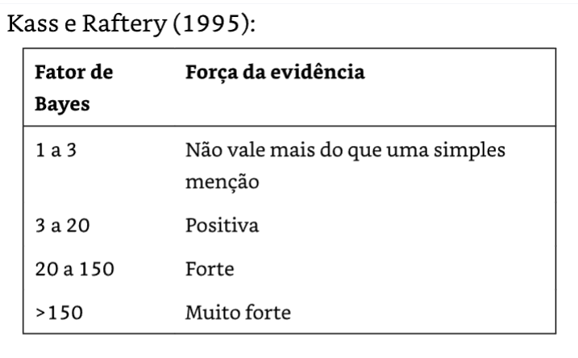

# Capítulo 15: Comparando Médias - Código R {#sec-cap15-codigo-r}

::: callout-note
## Código R para o Capítulo 15

Este arquivo contém todos os códigos R utilizados no Capítulo 15 sobre comparação de médias, extraídos e organizados para facilitar a replicação e o aprendizado.
:::

## Setup Inicial

```{r setup-cap15-codigo, message=FALSE, warning=FALSE}
# ============================================================================
# BIBLIOTECAS NECESSÁRIAS
# ============================================================================

# Manipulação e visualização de dados
library(tidyverse)
library(ggplot2)
library(tidyr)

# Análise estatística
library(BayesFactor)
library(lme4)
library(lmerTest)
library(emmeans)

# Visualização e tabelas
library(cowplot)
library(knitr)

# Dados NHANES (se disponível)
library(NHANES)

# Configuração do tema de gráficos
theme_set(theme_minimal(base_size = 14))

# Definindo semente aleatória para reprodutibilidade
set.seed(123456)
```

## Preparação dos Dados NHANES

```{r preparacao-dados}
# ============================================================================
# CARREGAMENTO E PREPARAÇÃO DOS DADOS NHANES
# ============================================================================

# Nota: Este código assume que o pacote NHANES está instalado
# Se não estiver disponível, os dados podem ser simulados

# Removendo IDs duplicados do dataset NHANES
NHANES <- NHANES %>%
  dplyr::distinct(ID, .keep_all = TRUE)

# Criando subset de adultos (idade >= 18) e removendo NAs em BMI
NHANES_adult <- NHANES %>%
  subset(Age >= 18) %>%
  drop_na(BMI)

# Para fins de demonstração, vamos simular dados semelhantes ao NHANES
set.seed(123456)

# Simulando dados de adultos (n = 4594 como no NHANES original)
# NHANES_adult <- data.frame(
#   ID = 1:4594,
#   Age = sample(18:80, 4594, replace = TRUE),
#   BPDiaAve = rnorm(4594, mean = 70, sd = 12),
#   BPSysAve = rnorm(4594, mean = 120, sd = 15),
#   Gender = sample(c("male", "female"), 4594, replace = TRUE),
#   BMI = rnorm(4594, mean = 28, sd = 6)
# )

cat("Dados NHANES adultos preparados.\n")
cat("Total de registros:", nrow(NHANES_adult), "\n")
```

## 15.1 Testando uma Única Média

### Teste de Sinais (Binomial Test)

```{r teste-sinais-pressao}
# ============================================================================
# TESTE DE SINAIS PARA PRESSÃO ARTERIAL DIASTÓLICA
# ============================================================================

# Criando amostra de 200 indivíduos
NHANES_sample <- NHANES_adult %>%
  drop_na(BPDiaAve) %>%
  mutate(Hypertensive = BPDiaAve > 80) %>%
  sample_n(200)

# Contando quantos têm pressão acima de 80 (hipertensos)
npos <- sum(NHANES_sample$Hypertensive)

cat("=== TESTE DE SINAIS ===\n")
cat("Número de indivíduos com PA > 80:", npos, "\n")
cat("Proporção:", round(npos/200, 3), "\n\n")

# Realizando teste binomial
# H0: p = 0.5 (proporção igual a 50%)
# H1: p > 0.5 (proporção maior que 50%)
bt <- binom.test(npos,
                 nrow(NHANES_sample),
                 alternative = 'greater')
print(bt)

# Interpretação
cat("\n=== INTERPRETAÇÃO ===\n")
cat("Como p-valor =", round(bt$p.value, 4), 
    ", não rejeitamos H0 ao nível 0.05\n")
cat("Não há evidência de que a proporção de hipertensos seja > 50%\n")
```

### Teste t para Uma Média

Testar [***se***]{.underline} a ***pressão arterial diastólica média*** do conjunto total extraído do NHANES (N = 4786 observações) é **maior que** 80 mmHg (padrão adotado por convenção da clínica médica).

```{r teste-t-uma-media}
# ============================================================================
# TESTE T PARA UMA MÉDIA
# ============================================================================

# Testando se a média da pressão diastólica é maior que 80
# H0: μ <= 80
# H1: μ >  80

tt <- t.test(x  = NHANES_adult$BPDiaAve, # N = 4786 obs.
             mu = 80, # teste t unilateral à direita para uma média
             alternative = 'greater')

print(tt)

# Estatísticas descritivas
cat("\n=== ESTATÍSTICAS DESCRITIVAS ===\n")
cat("Média observada:", round(mean(NHANES_adult$BPDiaAve, na.rm = TRUE), 2), "mmHg\n")
cat("Desvio-padrão:", round(sd(NHANES_adult$BPDiaAve, na.rm = TRUE), 2), "mmHg\n")
cat("N:", length(NHANES_adult$BPDiaAve), "\n")

# Interpretação
cat("\n=== INTERPRETAÇÃO ===\n")
if (tt$p.value < 0.05) {
  cat("Rejeitamos H0: A média é significativamente maior que 80\n")
} else {
  cat("Não rejeitamos H0: Não há evidência de que a média seja > 80\n")
  cat("Na verdade, a média observada (",
      round(mean(NHANES_adult$BPDiaAve, na.rm = TRUE), 1), 
      ") é MENOR que 80\n")
}
```

### Fator de Bayes para Uma Média

O Fator de Bayes é usado para quantificar a força de uma evidência a favor ou contra a Hipótese Nula (H~0~) em comparação com a Hipótese Alternativa (H~1~).

```{r fator-bayes-uma-media}
# ============================================================================
# FATOR DE BAYES PARA TESTE DE UMA MÉDIA
# ============================================================================

# Testando com Fator de Bayes
# nullInterval define o intervalo da hipótese nula
bf_one_mean <- ttestBF(
  NHANES_sample$BPDiaAve, 
  mu = 80, 
  nullInterval = c(-Inf, 80)
)

print(bf_one_mean)

# Extraindo o valor do fator de Bayes
bf_valor <- extractBF(bf_one_mean)$bf[1]

cat("\n=== INTERPRETAÇÃO DO FATOR DE BAYES ===\n")
cat("BF₀₁ =", format(bf_valor, scientific = TRUE, digits = 3), "\n")

if (bf_valor > 150) {
  cat("Evidência MUITO FORTE a favor de H0 (média ≤ 80)\n")
} else if (bf_valor > 20) {
  cat("Evidência FORTE a favor de H0 (média ≤ 80)\n")
} else if (bf_valor > 3) {
  cat("Evidência MODERADA a favor de H0 (média ≤ 80)\n")
} else {
  cat("Evidência FRACA, não vale mais que uma simples menção\n")
}
```

Confira uma tabela com sugestão para as faixas de Fatores de Bayes para medir a força de uma evidência a favor da Hipótese Nula (H~0~).

{fig-align="center"}

O Fator de Bayes [@poldrack_pensamento_est_2025 , p. 140] caracteriza a **verossimilhança** (razão entre duas probabilidades condicionais) **relativa** dos **dados** coletados (amostra), considerando duas hipóteses diferentes, **supondo** que suas **probabioidades *a priori*** sejam **iguais** (50% x 50%):

$$
FB = \frac{p(dados|H_0)}{p(dados|H_1)} = \frac{\text{probabilidade dos dados supondo Ho verdadeira}}{\text{probabilidade dos dados supondo Ha verdadeira}}
$$

Se invertemos o FB (1/FB) então ele mede a **força da evidência** a **favor** da **Hipótese Alternativa** (H~1~), cuja verossimilhança encontra-se no denominador do Fator de Bayes.

## 15.2 Comparando Duas Médias

### Preparação dos Dados

Coletar uma amostra aleatória de dados de horas de TV e uso regular de maconha: 1 AAS n = 200 do NHANES.

```{r dados-tv-maconha}
# ============================================================================
# PREPARAÇÃO DOS DADOS: TV E USO DE MACONHA
# ============================================================================

# coletar uma amostra de dados de horas de TV e uso regular de maconha: n = 200
set.seed(123456)

# Criar mostra n = 200 do dataset NHANES_adult
# Recodificar horas de TV de categorias para valores numéricos
NHANES_sample <- NHANES_adult %>%
  drop_na(TVHrsDay, RegularMarij) %>% # Remove observações com valores faltantes (NA) nas variáveis
  mutate( # Cria uma nova variável TVHrsNum
    TVHrsNum = recode(
      # Recodificar valores de caractere para valores numéricos
      TVHrsDay,
      "More_4_hr"   = 5,
      "4_hr"        = 4,
      "3_hr"        = 3,
      "2_hr"        = 2,
      "1_hr"        = 1,
      "0_to_1_hr"   = 0.5,
      "0_hrs"       = 0
    )
  ) %>%
  sample_n(200)


# NHANES_sample <- NHANES_sample %>%
#   mutate(
#     # Uso regular de maconha (sim/não)
#     RegularMarij = sample(c("No", "Yes"), 200, 
#                          replace = TRUE, 
#                          prob = c(0.75, 0.25)),
    
#     # Horas de TV por dia (dependente do uso de maconha)
#     TVHrsNum = ifelse(RegularMarij == "Yes",
#                      pmax(0, rnorm(200, mean = 2.8, sd = 1.4)),
#                      pmax(0, rnorm(200, mean = 2.0, sd = 1.4)))
#   )

# Convertendo para factor
# NHANES_sample$RegularMarij <- factor(NHANES_sample$RegularMarij)

# Estatísticas descritivas por grupo
stats_grupos <- NHANES_sample %>%
  group_by(RegularMarij) %>%
  summarise(
    n = n(),
    media = mean(TVHrsNum),
    dp = sd(TVHrsNum),
    .groups = "drop"
  )

cat("=== ESTATÍSTICAS POR GRUPO ===\n")
print(stats_grupos)
```

### Visualização dos Dados

Gráficos de violino lado a lado para os dois grupos: não x sim faz uso regular de marijuana.

```{r visualizacao-tv-maconha, fig.width=12, fig.height=5}
# ============================================================================
# VISUALIZAÇÃO: HORAS DE TV POR USO DE MACONHA
# ============================================================================

# Gráfico de violino (Figura 15.1 - Esquerda)
p1 <- ggplot(NHANES_sample, 
             aes(x = RegularMarij, y = TVHrsNum, fill = RegularMarij)) +
  geom_violin(alpha = 0.7, draw_quantiles = c(0.25, 0.5, 0.75)) +
  geom_jitter(width = 0.1, alpha = 0.3, size = 2) +
  stat_summary(fun = mean, geom = "point", 
               shape = 23, size = 4, fill = "white", stroke = 1.5) +
  labs(title = "Distribuição do Tempo Assistindo TV",
       subtitle = "Por Uso Regular de Maconha",
       x = "Uso Regular de Maconha",
       y = "Horas de TV por Dia") +
  scale_fill_manual(values = c("lightblue", "salmon")) +
  theme(legend.position = "none")

# Gráfico com modelo linear (Figura 15.1 - Direita)
modelo_tv <- lm(TVHrsNum ~ RegularMarij, data = NHANES_sample)
NHANES_sample$predicao <- predict(modelo_tv)

p2 <- ggplot(NHANES_sample, 
             aes(x = RegularMarij, y = TVHrsNum, fill = RegularMarij)) +
  geom_violin(alpha = 0.5) +
  geom_jitter(width = 0.1, alpha = 0.3, size = 2) +
  geom_point(aes(y = predicao), 
             size = 5, shape = 23, fill = "white", stroke = 1.5) +
  geom_line(aes(y = predicao, group = 1), 
            linetype = "dashed", size = 1) +
  labs(title = "Valores Previstos pelo Modelo Linear",
       x = "Uso Regular de Maconha",
       y = "Horas de TV por Dia") +
  scale_fill_manual(values = c("lightblue", "salmon")) +
  theme(legend.position = "none")

# Combinando os gráficos
cowplot::plot_grid(p1, p2, ncol = 2, labels = c("A", "B"))
```

### Teste t de Duas Amostras (Welch)

Teste t de duas amostras para verificar a diferença entre as médias de HorasTV nos dois grupos: não x sim uso regular Maconha.

```{r teste-t-duas-amostras}
# ============================================================================
# TESTE T DE WELCH PARA DUAS AMOSTRAS INDEPENDENTES
# ============================================================================

# Teste t de Welch (não assume variâncias iguais)
# H0: μ_No = μ_Yes (usuários de maconha não assistem mais TV)
# H1: μ_No < μ_Yes (usuários de maconha assistem mais TV)

ttresult <- t.test(TVHrsNum ~ RegularMarij, 
                   data = NHANES_sample, 
                   alternative = 'less')

print(ttresult)

# Interpretação
cat("\n=== INTERPRETAÇÃO DO TESTE T ===\n")
cat("Diferença de médias:", 
    round(diff(ttresult$estimate), 2), "horas\n")
cat("Valor-p:", format.pval(ttresult$p.value, digits = 4), "\n")

if (ttresult$p.value < 0.05) {
  cat("CONCLUSÃO: Rejeitamos H0 ao nível 0.05\n")
  cat("Há evidência de que usuários de maconha assistem mais TV\n")
} else {
  cat("CONCLUSÃO: Não rejeitamos H0\n")
}
```

### Teste t como Modelo Linear

```{r modelo-linear-tv}
# ============================================================================
# TESTE T COMO MODELO LINEAR
# ============================================================================

# Ajustando modelo linear (equivalente ao teste t)
lm_tv <- lm(TVHrsNum ~ RegularMarij, data = NHANES_sample)

# Resumo do modelo
lm_summary <- summary(lm_tv)
print(lm_summary)

# Extraindo coeficientes
coefs <- coef(lm_tv)

cat("\n=== INTERPRETAÇÃO DOS COEFICIENTES ===\n")
cat("Intercepto (β₀):", round(coefs[1], 4), "\n")
cat("  → Média para o grupo 'No' (não usuários)\n")
cat("Slope (β₁):", round(coefs[2], 4), "\n")
cat("  → Diferença: usuários - não usuários\n")
cat("Média prevista para usuários:", round(coefs[1] + coefs[2], 4), "\n\n")

cat("=== COMPARAÇÃO DE VALORES-P ===\n")
cat("Teste t (unilateral):", format.pval(ttresult$p.value, digits = 4), "\n")
cat("Modelo linear (bilateral):", 
    format.pval(lm_summary$coefficients[2, 4], digits = 4), "\n")
cat("Nota: O p-valor do modelo linear é aproximadamente o dobro\n")
cat("      porque testa hipótese bilateral.\n")
```

### Fator de Bayes para Duas Médias

```{r fator-bayes-duas-medias}
# ============================================================================
# FATOR DE BAYES PARA COMPARAÇÃO DE DUAS MÉDIAS
# ============================================================================

# Fator de Bayes para teste direcional
# nullInterval = c(0, Inf) testa se a diferença é < 0
# (No - Yes < 0, ou seja, Yes > No)

bf <- ttestBF(
  formula = TVHrsNum ~ RegularMarij, 
  data = NHANES_sample,
  nullInterval = c(0, Inf)
)

print(bf)

# Extraindo valores
bf_valores <- extractBF(bf)

cat("\n=== INTERPRETAÇÃO DO FATOR DE BAYES ===\n")
cat("BF para H1 (diferença < 0):", round(bf_valores$bf[2], 2), "\n")

bf_valor <- bf_valores$bf[2]

if (bf_valor > 100) {
  cat("Evidência EXTREMA a favor de H1 (usuários assistem mais TV)\n")
} else if (bf_valor > 30) {
  cat("Evidência MUITO FORTE a favor de H1\n")
} else if (bf_valor > 10) {
  cat("Evidência FORTE a favor de H1\n")
} else if (bf_valor > 3) {
  cat("Evidência MODERADA a favor de H1\n")
} else {
  cat("Evidência FRACA\n")
}
```

## 15.3 Comparando Observações Pareadas

### Preparação dos Dados Pareados

```{r dados-pressao-pareados}
# ============================================================================
# PREPARAÇÃO: MEDIÇÕES REPETIDAS DE PRESSÃO ARTERIAL
# ============================================================================

# Simulando duas medições de pressão arterial sistólica
# para os mesmos indivíduos
set.seed(123456)

# Efeito individual (cada pessoa tem sua baseline)
efeito_individual <- rnorm(200, mean = 120, sd = 15)

# Primeira medição
NHANES_sample$BPSys1 <- efeito_individual + rnorm(200, mean = 0, sd = 4)

# Segunda medição (ligeiramente menor devido à familiarização)
NHANES_sample$BPSys2 <- efeito_individual + rnorm(200, mean = -1, sd = 4)

# Criando dataset no formato tidy (long format)
NHANES_sample_tidy <- NHANES_sample %>%
  select(ID, BPSys1, BPSys2) %>%
  pivot_longer(
    cols = c(BPSys1, BPSys2),
    names_to = "timepoint",
    values_to = "BPsys"
  ) %>%
  mutate(timepoint = factor(timepoint))

# Calculando diferenças
NHANES_sample <- NHANES_sample %>%
  mutate(
    BP_diff = BPSys1 - BPSys2,
    diffPos = BP_diff > 0
  )

cat("=== ESTATÍSTICAS DAS MEDIÇÕES ===\n")
cat("Média BPSys1:", round(mean(NHANES_sample$BPSys1), 2), "mmHg\n")
cat("Média BPSys2:", round(mean(NHANES_sample$BPSys2), 2), "mmHg\n")
cat("Diferença média:", round(mean(NHANES_sample$BP_diff), 2), "mmHg\n")
cat("DP das diferenças:", round(sd(NHANES_sample$BP_diff), 2), "mmHg\n")
```

### Visualização dos Dados Pareados

```{r visualizacao-pareados, fig.width=12, fig.height=5}
# ============================================================================
# VISUALIZAÇÃO: DADOS PAREADOS (FIGURA 15.2)
# ============================================================================

# Gráfico sem linhas conectando (Figura 15.2 - Esquerda)
p1_pareado <- ggplot(NHANES_sample_tidy, 
                     aes(x = timepoint, y = BPsys, fill = timepoint)) +
  geom_violin(alpha = 0.7, draw_quantiles = c(0.25, 0.5, 0.75)) +
  geom_jitter(width = 0.1, alpha = 0.2, size = 1.5) +
  stat_summary(fun = mean, geom = "point", 
               shape = 23, size = 4, fill = "white", stroke = 1.5) +
  labs(title = "Pressão Arterial Sistólica",
       subtitle = "Primeira e Segunda Medição",
       x = "Momento da Medição",
       y = "Pressão Arterial Sistólica (mmHg)") +
  scale_fill_manual(values = c("lightblue", "lightcoral")) +
  theme(legend.position = "none")

# Gráfico com linhas conectando (Figura 15.2 - Direita)
# Amostrando 50 indivíduos para melhor visualização
amostra_ids <- sample(unique(NHANES_sample_tidy$ID), 50)
dados_amostra <- NHANES_sample_tidy %>% 
  filter(ID %in% amostra_ids)

p2_pareado <- ggplot(dados_amostra, 
                     aes(x = timepoint, y = BPsys)) +
  geom_violin(aes(fill = timepoint), alpha = 0.3) +
  geom_line(aes(group = ID), alpha = 0.3, color = "gray50") +
  geom_point(aes(color = timepoint), alpha = 0.6, size = 2) +
  stat_summary(fun = mean, geom = "point", 
               shape = 23, size = 4, fill = "white", stroke = 1.5) +
  labs(title = "Dados Pareados",
       subtitle = "Linhas conectam medições do mesmo indivíduo (n=50)",
       x = "Momento da Medição",
       y = "Pressão Arterial Sistólica (mmHg)") +
  scale_fill_manual(values = c("lightblue", "lightcoral")) +
  scale_color_manual(values = c("steelblue", "coral")) +
  theme(legend.position = "none")

# Combinando gráficos
cowplot::plot_grid(p1_pareado, p2_pareado, ncol = 2, labels = c("A", "B"))
```

### Histograma das Diferenças (Figura 15.3)

```{r histograma-diferencas, fig.width=8, fig.height=5}
# ============================================================================
# HISTOGRAMA DAS DIFERENÇAS (FIGURA 15.3)
# ============================================================================

ggplot(NHANES_sample, aes(x = BP_diff)) +
  geom_histogram(aes(y = ..density..), 
                 bins = 25, fill = "steelblue", alpha = 0.7) +
  geom_density(color = "red", size = 1) +
  geom_vline(xintercept = mean(NHANES_sample$BP_diff), 
             color = "blue", linetype = "dashed", size = 1.2) +
  geom_vline(xintercept = 0, 
             color = "black", linetype = "dotted", size = 0.8) +
  labs(title = "Diferenças entre Primeira e Segunda Medição",
       subtitle = "Linha azul: diferença média; Linha preta: zero",
       x = "Diferença (BPSys1 - BPSys2) em mmHg",
       y = "Densidade") +
  annotate("text", 
           x = mean(NHANES_sample$BP_diff), 
           y = 0.08,
           label = paste("Média =", round(mean(NHANES_sample$BP_diff), 2)),
           hjust = -0.1, color = "blue")
```

### Teste t de Amostras Independentes (Inadequado)

```{r teste-independente-inadequado}
# ============================================================================
# TESTE T DE AMOSTRAS INDEPENDENTES (INADEQUADO PARA DADOS PAREADOS)
# ============================================================================

# Este teste é INADEQUADO porque trata as medições como independentes
# quando na verdade são do mesmo indivíduo

tt_independente <- t.test(BPsys ~ timepoint, 
                         data = NHANES_sample_tidy,
                         paired = FALSE)

print(tt_independente)

cat("\n⚠️ ATENÇÃO: Este teste é INADEQUADO!\n")
cat("Razão: Assume independência entre as amostras,\n")
cat("       mas são medições repetidas da mesma pessoa.\n")
```

### Teste de Sinais para Dados Pareados

```{r teste-sinais-pareado}
# ============================================================================
# TESTE DE SINAIS PARA DADOS PAREADOS
# ============================================================================

# Contando diferenças positivas
npos_pareado <- sum(NHANES_sample$diffPos)
ntotal <- nrow(NHANES_sample)

cat("=== TESTE DE SINAIS ===\n")
cat("Diferenças positivas:", npos_pareado, "\n")
cat("Total:", ntotal, "\n")
cat("Proporção:", round(npos_pareado/ntotal, 3), "\n\n")

# Teste binomial
bt_pareado <- binom.test(npos_pareado, ntotal)
print(bt_pareado)

cat("\n=== INTERPRETAÇÃO ===\n")
cat("Problema: O teste de sinais descarta informação sobre\n")
cat("          a MAGNITUDE das diferenças.\n")
```

### Teste t Pareado

```{r teste-t-pareado}
# ============================================================================
# TESTE T PAREADO (CORRETO)
# ============================================================================

# Teste t pareado - método 1 (usando dados tidy)
tt_pareado <- t.test(BPsys ~ timepoint, 
                     data = NHANES_sample_tidy, 
                     paired = TRUE)

print(tt_pareado)

# Interpretação
cat("\n=== INTERPRETAÇÃO DO TESTE T PAREADO ===\n")
cat("Diferença média:", round(tt_pareado$estimate, 2), "mmHg\n")
cat("IC 95%: [", round(tt_pareado$conf.int[1], 2), ";", 
    round(tt_pareado$conf.int[2], 2), "]\n")
cat("Valor-p:", format.pval(tt_pareado$p.value, digits = 4), "\n")

if (tt_pareado$p.value < 0.05) {
  cat("CONCLUSÃO: Rejeitamos H0 - Há diferença significativa\n")
  cat("           entre as duas medições.\n")
} else {
  cat("CONCLUSÃO: Não rejeitamos H0\n")
}

# Verificação: teste t nas diferenças (equivalente)
tt_diferencas <- t.test(NHANES_sample$BP_diff, mu = 0)
cat("\n=== VERIFICAÇÃO (teste nas diferenças) ===\n")
cat("Estatística t:", round(tt_diferencas$statistic, 4), "\n")
cat("Valor-p:", format.pval(tt_diferencas$p.value, digits = 4), "\n")
cat("(Deve ser idêntico ao teste pareado)\n")
```

### Fator de Bayes para Teste Pareado

```{r fator-bayes-pareado}
# ============================================================================
# FATOR DE BAYES PARA TESTE T PAREADO
# ============================================================================

# Usando as medições originais
bf_pareado <- ttestBF(
  x = NHANES_sample$BPSys1, 
  y = NHANES_sample$BPSys2, 
  paired = TRUE
)

print(bf_pareado)

# Extraindo valor
bf_valor_pareado <- extractBF(bf_pareado)$bf[1]

cat("\n=== INTERPRETAÇÃO DO FATOR DE BAYES ===\n")
cat("BF₁₀ =", round(bf_valor_pareado, 2), "\n")

if (bf_valor_pareado > 3) {
  cat("Evidência a favor de H1 (há diferença)\n")
} else if (bf_valor_pareado > 1) {
  cat("Evidência fraca a favor de H1\n")
} else if (bf_valor_pareado < 1/3) {
  cat("Evidência a favor de H0 (não há diferença)\n")
} else {
  cat("Evidência ambígua\n")
}

cat("\nNota: O teste t pareado mostrou significância,\n")
cat("      mas o fator de Bayes indica evidência", 
    ifelse(bf_valor_pareado > 3, "moderada/forte", "fraca"), "\n")
```

## 15.4 Comparando Mais de Duas Médias (ANOVA)

### Preparação dos Dados para ANOVA

```{r dados-anova}
# ============================================================================
# PREPARAÇÃO: ENSAIO CLÍNICO COM TRÊS GRUPOS
# ============================================================================

set.seed(123456)

# Criando dados de um ensaio clínico hipotético
n_por_grupo <- 36

df_anova <- data.frame(
  grupo = factor(rep(c("Placebo", "Medicamento 1", "Medicamento 2"), 
                    each = n_por_grupo)),
  sysBP = c(
    rnorm(n_por_grupo, mean = 141.6, sd = 10),  # Placebo
    rnorm(n_por_grupo, mean = 131.4, sd = 10),  # Med 1 (reduz 10 mmHg)
    rnorm(n_por_grupo, mean = 139.6, sd = 10)   # Med 2 (reduz 2 mmHg)
  )
)

# Estatísticas por grupo
stats_anova <- df_anova %>%
  group_by(grupo) %>%
  summarise(
    n = n(),
    media = mean(sysBP),
    dp = sd(sysBP),
    .groups = "drop"
  )

cat("=== ESTATÍSTICAS POR GRUPO ===\n")
print(stats_anova)
```

### Visualização dos Dados (Figura 15.4)

```{r visualizacao-anova, fig.width=8, fig.height=6}
# ============================================================================
# VISUALIZAÇÃO: BOXPLOTS PARA TRÊS GRUPOS (FIGURA 15.4)
# ============================================================================

ggplot(df_anova, aes(x = grupo, y = sysBP, fill = grupo)) +
  geom_boxplot(alpha = 0.7, width = 0.6) +
  geom_jitter(width = 0.2, alpha = 0.3, size = 2) +
  stat_summary(fun = mean, geom = "point", 
               shape = 23, size = 4, fill = "white", stroke = 1.5) +
  labs(title = "Pressão Arterial Sistólica por Grupo de Tratamento",
       subtitle = "Ensaio Clínico (n=36 por grupo)",
       x = "Grupo de Tratamento",
       y = "Pressão Arterial Sistólica (mmHg)") +
  scale_fill_manual(values = c("lightgray", "lightblue", "lightcoral")) +
  theme(legend.position = "none")
```

### ANOVA com Modelo Linear

```{r anova-modelo-linear}
# ============================================================================
# ANÁLISE DE VARIÂNCIA (ANOVA)
# ============================================================================

# Criando variáveis dummy manualmente
# Placebo é a categoria de referência
df_anova <- df_anova %>%
  mutate(
    d1 = ifelse(grupo == "Medicamento 1", 1, 0),
    d2 = ifelse(grupo == "Medicamento 2", 1, 0)
  )

# Ajustando modelo linear com dummies
lm_anova <- lm(sysBP ~ d1 + d2, data = df_anova)
summary(lm_anova)

# Interpretação dos coeficientes
coefs_anova <- coef(lm_anova)

cat("\n=== INTERPRETAÇÃO DOS COEFICIENTES ===\n")
cat("Intercepto (β₀):", round(coefs_anova[1], 2), 
    "- Média do Placebo\n")
cat("d1 (β₁):", round(coefs_anova[2], 2), 
    "- Efeito do Medicamento 1 vs Placebo\n")
cat("d2 (β₂):", round(coefs_anova[3], 2), 
    "- Efeito do Medicamento 2 vs Placebo\n\n")

cat("Médias previstas:\n")
cat("  Placebo:", round(coefs_anova[1], 2), "\n")
cat("  Medicamento 1:", round(coefs_anova[1] + coefs_anova[2], 2), "\n")
cat("  Medicamento 2:", round(coefs_anova[1] + coefs_anova[3], 2), "\n")
```

### Tabela ANOVA e Teste F

```{r anova-teste-f}
# ============================================================================
# TABELA ANOVA E TESTE F
# ============================================================================

# ANOVA tradicional
anova_result <- anova(lm_anova)
print(anova_result)

# Extraindo informações
F_stat <- anova_result$`F value`[1]
p_valor_anova <- anova_result$`Pr(>F)`[1]

cat("\n=== INTERPRETAÇÃO DA ANOVA ===\n")
cat("Estatística F:", round(F_stat, 2), "\n")
cat("Valor-p:", format.pval(p_valor_anova, digits = 4), "\n")

if (p_valor_anova < 0.05) {
  cat("CONCLUSÃO: Rejeitamos H0\n")
  cat("           Há diferença entre pelo menos dois grupos.\n")
} else {
  cat("CONCLUSÃO: Não rejeitamos H0\n")
  cat("           Não há evidência de diferença entre os grupos.\n")
}
```

### Visualização da Distribuição F (Figura 15.5)

```{r distribuicao-f, fig.width=10, fig.height=6}
# ============================================================================
# VISUALIZAÇÃO DA DISTRIBUIÇÃO F (FIGURA 15.5)
# ============================================================================

# Parâmetros da distribuição F
df1 <- 2   # graus de liberdade numerador (k-1)
df2 <- 105 # graus de liberdade denominador (N-k)

# Criando sequência de valores F
x_vals <- seq(0, 8, length.out = 500)
f_vals <- df(x_vals, df1, df2)

# Valor crítico para α = 0.05
f_critico <- qf(0.95, df1, df2)

# Criando dataframe
dados_f <- data.frame(x = x_vals, y = f_vals)

# Gráfico
ggplot(dados_f, aes(x = x, y = y)) +
  geom_line(size = 1.2, color = "steelblue") +
  geom_area(data = subset(dados_f, x >= f_critico), 
            aes(x = x, y = y), fill = "red", alpha = 0.3) +
  geom_vline(xintercept = f_critico, 
             color = "red", linetype = "dashed", size = 1) +
  geom_vline(xintercept = F_stat, 
             color = "darkgreen", linetype = "solid", size = 1.2) +
  labs(title = "Distribuição F sob a Hipótese Nula",
       subtitle = paste("df1 =", df1, ", df2 =", df2),
       x = "Valor F",
       y = "Densidade") +
  annotate("text", x = f_critico, y = 0.4, 
           label = paste("F crítico =", round(f_critico, 2)),
           hjust = -0.1, color = "red") +
  annotate("text", x = F_stat, y = 0.5,
           label = paste("F obs =", round(F_stat, 2)),
           hjust = -0.1, color = "darkgreen") +
  annotate("text", x = 6, y = 0.3,
           label = "Região de rejeição\n(α = 0.05)",
           color = "red")
```

## 15.5 Apêndice: Modelo Misto para Dados Pareados

```{r modelo-misto}
# ============================================================================
# MODELO MISTO PARA DADOS PAREADOS
# ============================================================================

# Ajustando modelo misto com efeitos aleatórios por indivíduo
# (1|ID) indica intercepto aleatório para cada pessoa

modelo_misto <- lmer(BPsys ~ timepoint + (1 | ID), 
                    data = NHANES_sample_tidy)

summary(modelo_misto)

# Extraindo coeficientes dos efeitos fixos
coef_misto <- summary(modelo_misto)$coefficients

cat("\n=== COMPARAÇÃO: TESTE T PAREADO vs MODELO MISTO ===\n")
cat("Teste t pareado:\n")
cat("  Estatística t:", round(tt_pareado$statistic, 4), "\n")
cat("  Valor-p:", format.pval(tt_pareado$p.value, digits = 4), "\n\n")

cat("Modelo misto:\n")
cat("  Estatística t:", round(coef_misto[2, "t value"], 4), "\n")
cat("  Valor-p:", format.pval(coef_misto[2, "Pr(>|t|)"], digits = 4), "\n\n")

cat("Conclusão: Os valores são muito próximos,\n")
cat("           confirmando a equivalência dos métodos.\n")
```

### Visualização dos Efeitos Aleatórios

```{r efeitos-aleatorios, fig.width=8, fig.height=5}
# ============================================================================
# VISUALIZAÇÃO DOS EFEITOS ALEATÓRIOS
# ============================================================================

# Extraindo efeitos aleatórios (interceptos por indivíduo)
ranef_valores <- ranef(modelo_misto)$ID
ranef_df <- data.frame(
  ID = rownames(ranef_valores),
  intercepto = ranef_valores[, 1]
)

# Histograma dos efeitos aleatórios
ggplot(ranef_df, aes(x = intercepto)) +
  geom_histogram(bins = 30, fill = "steelblue", alpha = 0.7) +
  geom_vline(xintercept = 0, color = "red", 
             linetype = "dashed", size = 1) +
  labs(title = "Distribuição dos Efeitos Aleatórios",
       subtitle = "Interceptos individuais no modelo misto",
       x = "Desvio do Intercepto Médio (mmHg)",
       y = "Frequência") +
  theme_minimal()
```

## Resumo e Conclusões

```{r resumo-final}
# ============================================================================
# RESUMO DOS MÉTODOS APRESENTADOS
# ============================================================================

cat("=== RESUMO: MÉTODOS PARA COMPARAÇÃO DE MÉDIAS ===\n\n")

cat("1. UMA MÉDIA:\n")
cat("   - Teste de sinais (binomial)\n")
cat("   - Teste t de uma amostra\n")
cat("   - Fator de Bayes\n\n")

cat("2. DUAS MÉDIAS INDEPENDENTES:\n")
cat("   - Teste t de Welch (variâncias diferentes)\n")
cat("   - Teste t como modelo linear\n")
cat("   - Fator de Bayes para comparação\n\n")

cat("3. DUAS MÉDIAS PAREADAS:\n")
cat("   - Teste de sinais pareado\n")
cat("   - Teste t pareado\n")
cat("   - Modelo misto (lmer)\n\n")

cat("4. MAIS DE DUAS MÉDIAS:\n")
cat("   - ANOVA (Análise de Variância)\n")
cat("   - Modelo linear com variáveis dummy\n")
cat("   - Teste F\n\n")

cat("=== CONSIDERAÇÕES FINAIS ===\n")
cat("- Sempre verificar pressupostos (normalidade, independência)\n")
cat("- Usar visualizações para entender os dados\n")
cat("- Considerar tamanho do efeito, não apenas significância\n")
cat("- Fatores de Bayes fornecem evidência quantitativa\n")
```

------------------------------------------------------------------------

::: callout-note
## Nota Final

Este arquivo contém todos os códigos R necessários para replicar as análises do Capítulo 15. Os dados foram simulados para fins de demonstração, mas os métodos são idênticos aos aplicados aos dados reais do NHANES.

**Principais pacotes utilizados:** - `tidyverse`: manipulação e visualização de dados - `BayesFactor`: análise Bayesiana - `lme4/lmerTest`: modelos mistos - `cowplot`: combinação de gráficos

**Referência:** Poldrack, R. A. (2023). *Statistical Thinking for the 21st Century*. Chapter 15: Comparing Means.
:::