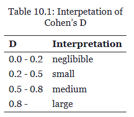

# Inferência sobre uma Média Populacional {#sec-cap20-inferencia-media}

::: callout-note
## Capítulo 20 - Inferência sobre uma Média Populacional

Este capítulo apresenta métodos práticos para ***inferência*** estatística sobre a ***média*** de [***uma população***]{.underline} quando o [***desvio-padrão populacional***]{.underline} é [**desconhecido**]{.underline}, *usando* a [**distribuição t de Student**]{.underline}.
:::

## Introdução

No Capítulo 17, aprendemos os fundamentos dos **Testes de Significância contra uma Hipótese Nula** (TSHo) usando a distribuição **Normal padrão** (**procedimentos z**).

No entanto, esses métodos exigem conhecimento do desvio-padrão populacional σ, o que raramente ocorre na prática.

Neste capítulo, desenvolveremos [**métodos mais realistas**]{.underline} que:

1.  **Não exigem** conhecimento de σ
2.  **Usam** o desvio-padrão amostral s como [**estimativa**]{.underline} de σ
3.  **Aplicam** a **distribuição t** de Student
4.  **Fornecem** [**intervalos de confiança**]{.underline} e [**testes**]{.underline} práticos (TSHo)

```{r setup, message=FALSE, warning=FALSE}
# Carregando bibliotecas necessárias
library(tidyverse)
library(ggplot2)
library(scales)
library(knitr)
library(kableExtra)
library(gridExtra)

# Configurações
theme_set(theme_minimal(base_size = 12))
set.seed(123)
```

## 20.1 A Distribuição t {#sec-distribuicao-t}

### O Problema com σ Desconhecido

Quando σ é ***desconhecido***, **substituímos** pela **estimativa amostral** s.

No entanto, a [**estatística**]{.underline}:

$$\frac{\bar{x} - \mu}{s/\sqrt{n}}$$

**NÃO** tem distribuição Normal padrão, mas sim **distribuição** **t de Student**.

### Propriedades da Distribuição t

```{r distribuicao-t}
# Comparando distribuições Normal e t
x_vals <- seq(-4, 4, length.out = 1000)

# Distribuições
normal_vals <- dnorm(x_vals)
t1_vals <- dt(x_vals, df = 1)
t5_vals <- dt(x_vals, df = 5)
t10_vals <- dt(x_vals, df = 10)

# DataFrame para ggplot
df_dist <- data.frame(
  x = rep(x_vals, 4),
  densidade = c(normal_vals, t1_vals, t5_vals, t10_vals),
  distribuicao = rep(c("Normal(0,1)", "t(gl=1)", "t(gl=5)", "t(gl=10)"), 
                    each = length(x_vals))
)

# Gráfico comparativo
ggplot(df_dist, aes(x = x, y = densidade, color = distribuicao)) +
  geom_line(size = 1.2) +
  scale_color_manual(values = c("Normal(0,1)" = "black", "t(gl=1)" = "red", 
                               "t(gl=5)" = "blue", "t(gl=10)" = "green")) +
  labs(
    title = "Comparação: Distribuição Normal vs t de Student",
    subtitle = "Efeito dos graus de liberdade na forma da distribuição",
    x = "Valores",
    y = "Densidade de Probabilidade",
    color = "Distribuição"
  ) +
  theme(legend.position = "bottom")
```

## Características da Distribuição t

1.  **Simétrica** em torno de zero (como a Normal)? forma de sino
2.  **Mais dispersa** que a Normal padrão (caudas mais espessas ou pesadas)
3.  **Converge** para Normal padrão quando gl → ∞
4.  **Forma** determinada pelos graus de liberdade (gl = n - 1): uma família distribuição-t

A distribuição t tem caudas mais expessas que a distribuição normal para graus de liberdade pequenos (amostras pequenas).

Ela se aproxima da distribuição Normal à medida que os graus de liberdade aumentam, ou seja, para amostras grandes, assim consideradas aquelas com: n ≥ 30 [@poldrack_pensamento_est_2025 , p. 86] ou n ≥ 40 [@Moore2023 , p. 365].

Quando o poder de um teste é considerado, ex. (1 - 𝛽) ≥ 80%, então o ideal seria n ≥ 50 [@poldrack_pensamento_est_2025 , p. 85, p. 126, fig. 10.5] se desejamos detectar um tamanho de efeito d *padronizado* de Jacob Cohen (1994) intermediário (d = 0,5 a 0,8).

$$
d = \frac{\bar{X_1} - \bar{X_2}}{s}
$$

Essa **medida** quantifica a diferença (o efeito que se pretende capturar) entre duas médias em termos de seu ***desvio padrão combinado***.

$$
s = \sqrt{ \frac{(n_1-1)s_1^2 + (n_2-1)s_2^2}{n_1+n_2-2} }
$$

A tabela a seguir apresenta um padrão de interpretação para classes de valores do d de Cohen [@poldrack_pensamento_est_2025 , p. 123, tab. 10.1].

{fig-align="center"}

Os conceitos de ***graus de liberdade*** aparecem no *numerador* e no *denominador* do **desvio padrão combinado** de duas amostras de tamanhos diferentes.

### Graus de Liberdade

Os graus de liberdade para uma amostra de tamanho n são determinados pela expressão:

$$
gl = n -1
$$

Isso porque, ao calcularmos uma média amostral, perdemos um grau de liberdade.

Ou seja, se você conhece a média de ***uma amostra independente*** de tamanho n, então será capaz de determinar o valor de 1 ponto amostral se lhe forem informados os demais n-1 pontos amostrais.

```{r graus-liberdade-conceito}
# Demonstrando o conceito de graus de liberdade
cat("CONCEITO DE GRAUS DE LIBERDADE\n")
cat("==============================\n\n")

# Exemplo com amostra pequena
amostra_exemplo <- c(2, 4, 6, 8, 10)
n <- length(amostra_exemplo)
media <- mean(amostra_exemplo)

cat("Amostra:", paste(amostra_exemplo, collapse = ", "), "\n")
cat("Tamanho da amostra (n):", n, "\n")
cat("Média amostral:", media, "\n")
cat("Graus de liberdade (gl = n - 1):", n - 1, "\n\n")

cat("Por que gl = n - 1?\n")
cat("- Temos n observações independentes\n")
cat("- Mas conhecemos 1 restrição (a média)\n")
cat("- Logo, apenas (n-1) observações são 'livres'\n")
```

Se temos n observações independentes e [***conhecemos***]{.underline} sua [**média**]{.underline} (1 restrição) então *apenas n-1 observações são livres*, pois podemos calcular o valor de 1 dessas observações amostrais: 1 delas é restrita, ou seja, não é livre; as demais n-1 são livres.

E dizemos, assim, que perdemos 1 grau de liberdade quando calculamos uma média de uma amostra de tamanho n e que: gl = n -1.

## 20.2 Intervalos de Confiança para μ {#sec-ic-media-t}

### Fórmula do Intervalo de Confiança t

Quando σ é **desconhecido**, o intervalo de confiança para μ é:

$$\bar{x} \pm t^* \frac{s}{\sqrt{n}}$$

onde $t^*$ é o valor crítico da distribuição t com gl = n - 1.

A **média amostral** continua sendo a [***melhor estimativa***]{.underline} para a **média populacional** (TCL).

Mas, para **compensar** o uso do desvio-padrão amostral (s) para ***estimar*** o desvio-padrão populacional (σ), é necessário susbtituir o valor do Z-escore crítico ($z^*$) pelo valro do t-escore crítico ($t^*$). De modo que o Erro Padrão da amostra (TCL) passa a ser : $EP_{\bar{X}} = s / \sqrt{n}$.

### EXEMPLO 20.1: Tempo de Processamento de AJCMs

Simulando dados de tempo de processamento de AJCMs (em dias) até um suposto *despacho inicial* que aprecia o recebimento da denúncia e geralmente a recebe.

```{r exemplo-ajcm-tempo}
# Simulando dados de tempo de processamento de AJCMs (em dias)
# até o despacho inicial
set.seed(456)
tempos_ajcm <- c(15, 18, 12, 25, 20, 16, 14, 22, 19, 17, 21, 13, 24, 16, 18)

# Estatísticas descritivas
n <- length(tempos_ajcm)
media_amostral <- mean(tempos_ajcm)
desvio_amostral <- sd(tempos_ajcm)
erro_padrao <- desvio_amostral / sqrt(n)
gl <- n - 1

# Exibindo dados
cat("EXEMPLO 20.1: Tempo de Processamento de AJCMs\n")
cat("=============================================\n\n")
cat("Dados (dias):", paste(tempos_ajcm, collapse = ", "), "\n")
cat("Tamanho da amostra (n):", n, "\n")
cat("Média amostral (x̄):", round(media_amostral, 2), "dias\n")
cat("Desvio-padrão amostral (s):", round(desvio_amostral, 2), "dias\n")
cat("Erro padrão da amostra (s/√n):", round(erro_padrao, 2), "dias\n")
cat("Graus de liberdade:", gl, "\n\n")

# Intervalo de confiança 95%
confianca <- 0.95
alpha <- 1 - confianca
t_critico <- qt(1 - alpha/2, gl)

ic_inferior <- media_amostral - t_critico * erro_padrao
ic_superior <- media_amostral + t_critico * erro_padrao

cat("INTERVALO DE CONFIANÇA 95%:\n")
cat("Valor t* (gl =", gl, "):", round(t_critico, 3), "\n")
cat("Margem de erro:", round(t_critico * erro_padrao, 2), "dias\n")
cat("IC 95%: [", round(ic_inferior, 2), ",", round(ic_superior, 2), "] dias\n\n")

cat("INTERPRETAÇÃO:\n")
cat("Com 95% de confiança, o tempo médio de processamento\n")
cat("de AJCMs está entre", round(ic_inferior, 1), "e", round(ic_superior, 1), "dias.\n")
```

Como a amostra acima é pequena (n=15), só podemos considerar esse IC-95% válido se as seguintes condições forem satisfeitas [@Moore2023 , p. 365]:

1.  Os dados parecerem aproximadamente Normal;
2.  razoavelmente simétricos,
3.  com um único pico e
4.  sem valores atípicos (*outliers*);
5.  Se os dados forem claramente assimétricos ou se há ouliers não use procedimento-t.

### Visualização do Intervalo de Confiança 95%

```{r viz-ic-t}
# Gráfico da distribuição t com intervalo de confiança
x_seq <- seq(-4, 4, length.out = 1000)
y_seq <- dt(x_seq, gl)

# Região de confiança
x_conf <- seq(-t_critico, t_critico, length.out = 100)
y_conf <- dt(x_conf, gl)

# DataFrame para plotagem
df_t <- data.frame(x = x_seq, y = y_seq)
df_conf <- data.frame(x = x_conf, y = y_conf)

ggplot(df_t, aes(x = x, y = y)) +
  geom_line(size = 1.2, color = "blue") +
  geom_area(data = df_conf, aes(x = x, y = y), fill = "lightblue", alpha = 0.7) +
  geom_vline(xintercept = c(-t_critico, t_critico), color = "red", 
             linetype = "dashed", size = 1) +
  annotate("text", x = 0, y = max(y_seq) * 0.5, 
           label = paste0("Área = ", confianca), size = 4, fontface = "bold") +
  annotate("text", x = t_critico+0.03, y = 0.01, 
           label = paste0("t* = ", round(t_critico, 3)), 
           hjust = 0, color = "red") +
  labs(
    title = paste0("Distribuição t com ", gl, " graus de liberdade"),
    subtitle = paste0("Intervalo de confiança ", confianca * 100, "%"),
    x = "Valores t",
    y = "Densidade"
  )
```

A figura acima representa a curva suave da distribuição-t com gl = 15-1=14 graus de liberdade.

Lembrar que o procedimento-t [***náo é robusto***]{.underline} a desvios da normalidade para pequenas amostras.

### Comparação com Diferentes Níveis de Confiança

Quanto maior o Nível de Confiança maior a amplitude do respectivo Intervalo de Confiança, mantidas todas as demais características amostrais: mesmo tamanho de amostra (n) e mesmo desvio-padrão populacional (σ).

```{r ic-multiplos-niveis}
# Calculando ICs para diferentes níveis de confiança
niveis_conf <- c(0.90, 0.95, 0.99)
resultados_ic <- data.frame(
  NC = paste0(niveis_conf * 100, "%"),
  t_critico = sapply(niveis_conf, function(conf) qt(1 - (1-conf)/2, gl)),
  Margem_Erro = NA,
  IC_Inferior = NA,
  IC_Superior = NA,
  Amplitude = NA
)

for(i in 1:length(niveis_conf)) {
  t_crit <- resultados_ic$t_critico[i]
  margem <- t_crit * erro_padrao
  ic_inf <- media_amostral - margem
  ic_sup <- media_amostral + margem
  
  resultados_ic$Margem_Erro[i] <- round(margem, 2)
  resultados_ic$IC_Inferior[i] <- round(ic_inf, 2)
  resultados_ic$IC_Superior[i] <- round(ic_sup, 2)
  resultados_ic$Amplitude[i] <- round(ic_sup - ic_inf, 2)
}

cat("COMPARAÇÃO DE INTERVALOS DE CONFIANÇA:\n")
print(kable(resultados_ic, digits = 3, align = "c"))

cat("\nOBSERVAÇÕES:\n")
cat("- Maior confiança → Maior amplitude do intervalo\n")
cat("- Trade-off entre precisão e confiança\n")
```

O gráfico a seguir ilustra o efeito do aumento do Nível de Significância na amplitude dos Intervalos de Confiança.

```{r}
# ============================================================================
# GRÁFICO 1: INTERVALOS DE CONFIANÇA COMPARATIVOS
# ============================================================================

# Preparando dados para visualização
dados_grafico <- resultados_ic %>%
  mutate(
    Media = media_amostral,
    Ordem = factor(NC, levels = rev(NC))  # Invertendo ordem para melhor visualização
  )

# Criando gráfico de intervalos de confiança
p1 <- ggplot(dados_grafico, aes(y = Ordem)) +
  # Intervalos de confiança
  geom_segment(aes(x = IC_Inferior, xend = IC_Superior, 
                   y = Ordem, yend = Ordem, color = Ordem),
               size = 2, alpha = 0.7) +
  
  # Pontos nas extremidades
  geom_point(aes(x = IC_Inferior, color = Ordem), size = 3) +
  geom_point(aes(x = IC_Superior, color = Ordem), size = 3) +
  
  # Média amostral
  geom_point(aes(x = Media), size = 4, shape = 18, color = "black") +
  geom_vline(xintercept = media_amostral, linetype = "dashed", 
             color = "black", alpha = 0.5) +
  
  # Anotações
  geom_text(aes(x = IC_Superior + 0.1, label = paste0("Amp: ", Amplitude, " dias")),
            hjust = 0, size = 3.5, fontface = "bold") +
  
  scale_color_manual(values = c("99%" = "#e74c3c", 
                                "95%" = "#3498db", 
                                "90%" = "#2ecc71")) +
  
  labs(
    title = "Comparação de Intervalos de Confiança em Diferentes Níveis",
    subtitle = paste0("Média amostral = ", round(media_amostral, 2), 
                     " dias | n = ", n, " | EP = ", round(erro_padrao, 2)),
    x = "Tempo de Processamento (dias)",
    y = "Nível de Confiança",
    caption = "Diamante preto = média amostral | Quanto maior a confiança, maior a amplitude"
  ) +
  
  theme_minimal() +
  theme(
    plot.title = element_text(hjust = 0.5, size = 14, face = "bold"),
    plot.subtitle = element_text(hjust = 0.5, size = 11),
    legend.position = "none",
    axis.text.y = element_text(size = 12, face = "bold"),
    panel.grid.major.y = element_blank()
  ) +
  scale_x_continuous(
    limits = c(14, 22) # impõe limites inicial e final ao eixo x
  )

print(p1)
```

O gráfico a seguir ilustra agora o efeito do aumento do tamanho da amostra (n) na amplitude dos Intervalos de Confiança para um mesmo Nível de Significância para o peso médio do data set NHANES.

```{r}
# load the NHANES data library
library(NHANES)

# drop duplicated IDs within the NHANES dataset
NHANES <-
  NHANES %>%
  dplyr::distinct(ID,.keep_all=TRUE)

NHANES_adult <-
  NHANES %>%
  drop_na(Weight) %>%
  subset(Age>=18)

# take a sample from adults in NHANES and summarize their mean Weight
sampSize <- 250
NHANES_sample <- sample_n(NHANES_adult, sampSize)

# Um exemplo do efeito do tamanho da mostra na largura do intervalo de confiança para
# o peso médio no NHANES com AAS's de vários tamanhos
ssDf <-
  tibble(sampSize=c(10,20,30,40,50,75,100,200,300,400,500)) %>%
  mutate(
    meanWeight = mean(NHANES_sample$Weight),
    ci.lower = meanWeight + qt(0.025,sampSize)*sd(NHANES_adult$Weight)/sqrt(sampSize),
    ci.upper = meanWeight + qt(0.975,sampSize)*sd(NHANES_adult$Weight)/sqrt(sampSize)
  )

ggplot(ssDf, aes(sampSize, meanWeight)) +
  geom_point(size = 3) +
  geom_errorbar(aes(ymin = ci.lower, ymax = ci.upper), width = 0, linewidth = 1) +
  labs(
    x = "Tamanho da Amostra (n)",
    y = "Peso médio (kg))"
  )
```

Pelo gráfico acima vê-se que, se pretende um IC-95% com amplitude menor ou igual a 5 Kg então o tamanho amostral n ≥ 300 para a variável peso no data set NHANES (americanos adultos, descartados os NA's e as duplicidades).

## 20.3 Testes de Significância para μ {#sec-testes-t}

### Teste t de Uma Amostra

**Hipóteses:**

\- H₀: μ = μ₀ (valor especificado)\
- H₁: μ ≠ μ₀ (bilateral) ou μ \> μ₀ ou μ \< μ₀ (unilateral)

**Estatística de teste:** $$t = \frac{\bar{x} - \mu_0}{s/\sqrt{n}}$$

### EXEMPLO 20.2: Bom tempo, boas gorjetas?

Esse exemplo foi obtido com o seguinte prompt para o copilot: "R script comentado para exibir diagrama de ramo e folha, histograma com curva suave de densidade, boxplot, gráfico quantil-quantil e teste shapiro para verificar normalidade so seguinte exemplo: ...".

```{r}
# ============================================================================
# EXEMPLO 20.2: BOM TEMPO, BOAS GORJETAS?
# Análise Exploratória e Verificação de Normalidade
# ============================================================================

library(tidyverse)
library(ggplot2)
library(patchwork)
library(qqplotr)

# ============================================================================
# DADOS: GORJETAS PERCENTUAIS COM MENSAGEM DE BOM TEMPO
# ============================================================================

cat("EXEMPLO 20.2: BOM TEMPO, BOAS GORJETAS?\n")
cat("========================================\n\n")

cat("DADOS COLETADOS:\n")
cat("Gorjetas em percentual do total da conta (20 clientes)\n")
cat("quando receberam mensagem de BOM TEMPO na conta:\n\n")

# Gorjetas em percentual do total da conta (20 clientes)
gorjetas <- c(20.8, 18.7, 19.9, 20.6, 21.9, 23.4, 22.8, 24.9, 22.2, 20.3,
              24.9, 22.3, 27.0, 20.4, 22.2, 24.0, 21.1, 22.1, 22.0, 22.7)

# Exibindo os dados
cat("Primeira metade:  ", paste(gorjetas[1:10], collapse = ", "), "\n")
cat("Segunda metade:   ", paste(gorjetas[11:20], collapse = ", "), "\n\n")

# Criando data frame
dados_gorjetas <- data.frame(
  Cliente = 1:length(gorjetas),
  Gorjeta_Pct = gorjetas
)

# ============================================================================
# 1. DIAGRAMA DE RAMO E FOLHAS (STEM-AND-LEAF PLOT)
# ============================================================================

cat("═══════════════════════════════════════════════════════════════════════\n")
cat("1. DIAGRAMA DE RAMO E FOLHAS (Figura 20.2)\n")
cat("═══════════════════════════════════════════════════════════════════════\n\n")

cat("O diagrama de ramo e folhas é uma ferramenta clássica para visualizar\n")
cat("a distribuição dos dados mantendo os valores individuais visíveis.\n\n")

# Criando diagrama de ramo e folhas
stem(gorjetas, scale = 2)

cat("\n")
cat("INTERPRETAÇÃO:\n")
cat("• Ramo (stem): dígito das dezenas\n")
cat("• Folha (leaf): dígito das unidades e primeiro decimal\n")
cat("• Exemplo: '20 | 3 4 6 8' representa os valores 20.3, 20.4, 20.6, 20.8\n\n")

cat("OBSERVAÇÕES:\n")
cat("✓ A distribuição parece aproximadamente simétrica\n")
cat("✓ A maioria dos valores concentra-se entre 20% e 24%\n")
cat("✓ Há um valor relativamente alto (27.0%)\n")
cat("✓ Não há evidência de forte assimetria ou multimodalidade\n\n")

# ============================================================================
# 2. ESTATÍSTICAS DESCRITIVAS
# ============================================================================

cat("═══════════════════════════════════════════════════════════════════════\n")
cat("2. ESTATÍSTICAS DESCRITIVAS\n")
cat("═══════════════════════════════════════════════════════════════════════\n\n")

n <- length(gorjetas)
media <- mean(gorjetas)
mediana <- median(gorjetas)
dp <- sd(gorjetas)
var <- var(gorjetas)
cv <- (dp / media) * 100
q1 <- quantile(gorjetas, 0.25)
q3 <- quantile(gorjetas, 0.75)
iqr <- IQR(gorjetas)
minimo <- min(gorjetas)
maximo <- max(gorjetas)
amplitude <- maximo - minimo

cat("MEDIDAS DE POSIÇÃO:\n")
cat("-------------------\n")
cat("Tamanho da amostra (n):     ", n, "\n")
cat("Mínimo:                     ", round(minimo, 2), "%\n")
cat("Q1 (1º quartil):            ", round(q1, 2), "%\n")
cat("Mediana (Q2):               ", round(mediana, 2), "%\n")
cat("Média:                      ", round(media, 2), "%\n")
cat("Q3 (3º quartil):            ", round(q3, 2), "%\n")
cat("Máximo:                     ", round(maximo, 2), "%\n\n")

cat("MEDIDAS DE DISPERSÃO:\n")
cat("---------------------\n")
cat("Amplitude total:            ", round(amplitude, 2), "%\n")
cat("Intervalo interquartil:     ", round(iqr, 2), "%\n")
cat("Variância:                  ", round(var, 3), "\n")
cat("Desvio-padrão:              ", round(dp, 3), "%\n")
cat("Coeficiente de variação:    ", round(cv, 2), "%\n\n")

cat("OBSERVAÇÃO:\n")
cat("A média (", round(media, 2), "%) está próxima da mediana (", 
    round(mediana, 2), "%),\n", sep = "")
cat("sugerindo uma distribuição aproximadamente simétrica.\n\n")

# ============================================================================
# 3. HISTOGRAMA COM CURVA SUAVE DE DENSIDADE
# ============================================================================

cat("═══════════════════════════════════════════════════════════════════════\n")
cat("3. HISTOGRAMA COM CURVA DE DENSIDADE\n")
cat("═══════════════════════════════════════════════════════════════════════\n\n")

p1 <- ggplot(dados_gorjetas, aes(x = Gorjeta_Pct)) +
  # Histograma
  geom_histogram(aes(y = after_stat(density)), 
                 bins = 8, 
                 fill = "lightblue", 
                 color = "black", 
                 alpha = 0.7) +
  
  # Curva de densidade suavizada (kernel density)
  geom_density(color = "darkblue", 
               size = 1.5, 
               linetype = "solid",
               adjust = 1.5) +
  
  # Curva normal teórica
  stat_function(fun = dnorm, 
                args = list(mean = media, sd = dp),
                color = "red", 
                size = 1.2, 
                linetype = "dashed") +
  
  # Linhas de referência
  geom_vline(xintercept = media, 
             color = "darkgreen", 
             size = 1.2, 
             linetype = "solid") +
  geom_vline(xintercept = mediana, 
             color = "purple", 
             size = 1, 
             linetype = "dotted") +
  
  # Anotações
  annotate("text", x = media + 1, y = Inf, 
           label = paste0("Média = ", round(media, 2), "%"), 
           vjust = 1.5, 
           color = "darkgreen", 
           fontface = "bold",
           size = 4) +
  
  annotate("text", x = 26, y = 0.15, 
           label = "Densidade suavizada", 
           color = "darkblue", 
           fontface = "bold",
           size = 3.5) +
  
  annotate("text", x = 26, y = 0.13, 
           label = "Normal teórica", 
           color = "red", 
           fontface = "bold",
           size = 3.5) +
  
  labs(
    title = "Histograma com Curva de Densidade Suavizada",
    subtitle = "Distribuição das gorjetas com mensagem de bom tempo",
    x = "Gorjeta (% do total da conta)",
    y = "Densidade",
    caption = paste0("n = ", n, " | Média = ", round(media, 2), 
                    "% | DP = ", round(dp, 2), "%\n",
                    "Linha verde = média | Linha roxa = mediana | ",
                    "Linha azul = densidade suavizada | Linha vermelha = normal teórica")
  ) +
  
  theme_minimal() +
  theme(
    plot.title = element_text(hjust = 0.5, size = 14, face = "bold"),
    plot.subtitle = element_text(hjust = 0.5, size = 11),
    plot.caption = element_text(hjust = 0.5, size = 9)
  )

print(p1)

cat("\nINTERPRETAÇÃO DO HISTOGRAMA:\n")
cat("• A curva de densidade suavizada (azul) mostra o formato geral da distribuição\n")
cat("• A curva normal teórica (vermelha tracejada) está bem ajustada aos dados\n")
cat("• A distribuição parece aproximadamente simétrica e unimodal\n")
cat("• Não há evidência visual clara de desvio da normalidade\n\n")

# ============================================================================
# 4. BOXPLOT (DIAGRAMA DE CAIXA)
# ============================================================================

cat("═══════════════════════════════════════════════════════════════════════\n")
cat("4. BOXPLOT (DIAGRAMA DE CAIXA)\n")
cat("═══════════════════════════════════════════════════════════════════════\n\n")

# Identificando outliers
limite_inf <- q1 - 1.5 * iqr
limite_sup <- q3 + 1.5 * iqr
outliers <- gorjetas[gorjetas < limite_inf | gorjetas > limite_sup]

cat("LIMITES PARA DETECÇÃO DE OUTLIERS:\n")
cat("Limite inferior (Q1 - 1.5×IQR): ", round(limite_inf, 2), "%\n", sep = "")
cat("Limite superior (Q3 + 1.5×IQR): ", round(limite_sup, 2), "%\n", sep = "")
cat("Outliers detectados:            ", length(outliers), "\n")
if(length(outliers) > 0) {
  cat("Valores outliers:               ", paste(outliers, collapse = ", "), "%\n")
}
cat("\n")

p2 <- ggplot(dados_gorjetas, aes(x = "", y = Gorjeta_Pct)) +
  # Boxplot
  geom_boxplot(fill = "lightgreen", 
               alpha = 0.7, 
               outlier.color = "red", 
               outlier.size = 4,
               width = 0.5) +
  
  # Pontos individuais
  geom_jitter(width = 0.15, 
              alpha = 0.5, 
              size = 3,
              color = "gray40") +
  
  # Média
  stat_summary(fun = mean, 
               geom = "point", 
               shape = 18, 
               size = 6, 
               color = "darkblue") +
  
  # Linhas de referência dos quartis
  geom_hline(yintercept = q1, 
             linetype = "dashed", 
             color = "blue", 
             alpha = 0.5) +
  geom_hline(yintercept = mediana, 
             linetype = "solid", 
             color = "darkgreen", 
             alpha = 0.7,
             size = 1) +
  geom_hline(yintercept = q3, 
             linetype = "dashed", 
             color = "blue", 
             alpha = 0.5) +
  
  # Anotações
  annotate("text", x = 1.4, y = q1, 
           label = paste0("Q1 = ", round(q1, 2), "%"), 
           hjust = 0, color = "blue", size = 3.5) +
  annotate("text", x = 1.4, y = mediana, 
           label = paste0("Mediana = ", round(mediana, 2), "%"), 
           hjust = 0, color = "darkgreen", size = 3.5, fontface = "bold") +
  annotate("text", x = 1.4, y = q3, 
           label = paste0("Q3 = ", round(q3, 2), "%"), 
           hjust = 0, color = "blue", size = 3.5) +
  annotate("text", x = 1.4, y = media, 
           label = paste0("Média = ", round(media, 2), "%"), 
           hjust = 0, color = "darkblue", size = 3.5, fontface = "bold") +
  
  scale_y_continuous(breaks = seq(18, 28, by = 1)) +
  
  labs(
    title = "Boxplot das Gorjetas",
    subtitle = "Diamante azul = média | Linha verde = mediana",
    x = "",
    y = "Gorjeta (% do total da conta)",
    caption = paste0("Q1 = ", round(q1, 2), "% | Mediana = ", round(mediana, 2), 
                    "% | Q3 = ", round(q3, 2), "%\n",
                    "IQR = ", round(iqr, 2), "% | Outliers destacados em vermelho")
  ) +
  
  theme_minimal() +
  theme(
    plot.title = element_text(hjust = 0.5, size = 14, face = "bold"),
    plot.subtitle = element_text(hjust = 0.5, size = 11),
    plot.caption = element_text(hjust = 0.5, size = 9),
    axis.text.x = element_blank()
  )

print(p2)

cat("\nINTERPRETAÇÃO DO BOXPLOT:\n")
cat("• A caixa representa 50% dos dados centrais (entre Q1 e Q3)\n")
cat("• A linha verde dentro da caixa é a mediana\n")
cat("• O diamante azul representa a média\n")
cat("• Média e mediana estão próximas → sugere simetria\n")
cat("• As whiskers (bigodes) mostram a variabilidade dos dados\n")
if(length(outliers) > 0) {
  cat("• Há", length(outliers), "outlier(s) detectado(s)\n")
} else {
  cat("• Não há outliers detectados\n")
}
cat("\n")

# ============================================================================
# 5. GRÁFICO QUANTIL-QUANTIL (Q-Q PLOT)
# ============================================================================

cat("═══════════════════════════════════════════════════════════════════════\n")
cat("5. GRÁFICO QUANTIL-QUANTIL (Q-Q PLOT)\n")
cat("═══════════════════════════════════════════════════════════════════════\n\n")

cat("O Q-Q plot compara os quantis dos dados observados com os quantis\n")
cat("teóricos de uma distribuição normal. Se os dados forem normais,\n")
cat("os pontos devem estar próximos à linha de referência.\n\n")

# Calculando quantis teóricos e observados para anotações
quantis_teoricos <- qnorm(ppoints(n))
quantis_observados <- sort(gorjetas)
correlacao_qq <- cor(quantis_teoricos, quantis_observados)

cat("CORRELAÇÃO Q-Q:\n")
cat("Correlação entre quantis teóricos e observados: ", 
    round(correlacao_qq, 4), "\n", sep = "")
cat("(Valores > 0.95 indicam boa aderência à normalidade)\n\n")

# Q-Q Plot simples e efetivo
p3 <- ggplot(dados_gorjetas, aes(sample = Gorjeta_Pct)) +
  geom_qq(color = "steelblue", size = 3, alpha = 0.7) +
  geom_qq_line(color = "red", size = 1, linetype = "dashed") +
  labs(
    title = "Q-Q Plot: Verificação de Normalidade",
    x = "Quantis Teóricos",
    y = "Quantis Amostrais",
    caption = "Pontos próximos à linha vermelha indicam normalidade"
  ) +
  theme_minimal() +
  theme(plot.title = element_text(hjust = 0.5, face = "bold"))

print(p3)

cat("\nINTERPRETAÇÃO DO Q-Q PLOT:\n")
cat("CRITÉRIOS DE AVALIAÇÃO:\n")
cat("• Pontos próximos à linha vermelha → dados normais\n")
cat("• Pontos dentro da banda azul → aceitável\n")
cat("• Curvatura no início → assimetria à esquerda\n")
cat("• Curvatura no fim → assimetria à direita\n")
cat("• Forma de S → caudas pesadas\n\n")

cat("AVALIAÇÃO DOS DADOS:\n")
if(correlacao_qq > 0.98) {
  cat("✓ Excelente aderência à normalidade (r > 0.98)\n")
} else if(correlacao_qq > 0.95) {
  cat("✓ Boa aderência à normalidade (r > 0.95)\n")
} else if(correlacao_qq > 0.90) {
  cat("⚠ Aderência moderada à normalidade (r > 0.90)\n")
} else {
  cat("✗ Possível desvio da normalidade (r < 0.90)\n")
}
cat("• A maioria dos pontos está próxima à linha de referência\n")
cat("• Não há padrão sistemático de desvio\n")
cat("• Os dados parecem aproximadamente normais\n\n")

# ============================================================================
# 6. TESTE DE SHAPIRO-WILK PARA NORMALIDADE
# ============================================================================

cat("═══════════════════════════════════════════════════════════════════════\n")
cat("6. TESTE DE SHAPIRO-WILK PARA NORMALIDADE\n")
cat("═══════════════════════════════════════════════════════════════════════\n\n")

cat("O teste de Shapiro-Wilk é um teste formal de hipótese que avalia\n")
cat("se os dados provêm de uma distribuição normal.\n\n")

cat("HIPÓTESES:\n")
cat("H₀: Os dados seguem uma distribuição normal\n")
cat("H₁: Os dados NÃO seguem uma distribuição normal\n")
cat("α = 0.05 (nível de significância)\n\n")

# Realizando teste de Shapiro-Wilk
shapiro_test <- shapiro.test(gorjetas)

cat("RESULTADOS DO TESTE:\n")
cat("====================\n")
cat("Estatística W:  ", round(shapiro_test$statistic, 5), "\n", sep = "")
cat("p-valor:        ", round(shapiro_test$p.value, 5), "\n", sep = "")
cat("\n")

cat("INTERPRETAÇÃO:\n")
cat("--------------\n")
if(shapiro_test$p.value > 0.10) {
  cat("✓ p-valor > 0.10: NÃO HÁ evidência contra a normalidade\n")
  cat("  Conclusão: NÃO REJEITAMOS H₀\n")
  cat("  Os dados são consistentes com uma distribuição normal.\n")
} else if(shapiro_test$p.value > 0.05) {
  cat("⚠ 0.05 < p-valor ≤ 0.10: Evidência FRACA contra a normalidade\n")
  cat("  Conclusão: NÃO REJEITAMOS H₀ (marginalmente)\n")
  cat("  Os dados são razoavelmente consistentes com normalidade.\n")
} else {
  cat("✗ p-valor ≤ 0.05: HÁ evidência contra a normalidade\n")
  cat("  Conclusão: REJEITAMOS H₀\n")
  cat("  Os dados sugerem desvio da normalidade.\n")
}

cat("\n")
cat("NOTAS IMPORTANTES:\n")
cat("• O teste de Shapiro-Wilk é sensível ao tamanho da amostra\n")
cat("• Com n pequeno (n < 30), o teste tem baixo poder\n")
cat("• Com n grande, até pequenos desvios são detectados\n")
cat("• A análise gráfica (Q-Q plot) é tão importante quanto o teste\n")
cat("• Para n =", n, ", o teste é adequado mas não definitivo\n\n")

# Estatística W interpretada
cat("SOBRE A ESTATÍSTICA W:\n")
cat("• W varia entre 0 e 1\n")
cat("• W próximo de 1 → boa aderência à normalidade\n")
cat("• W observado = ", round(shapiro_test$statistic, 5), "\n", sep = "")
if(shapiro_test$statistic > 0.95) {
  cat("• Interpretação: EXCELENTE aderência (W > 0.95)\n")
} else if(shapiro_test$statistic > 0.90) {
  cat("• Interpretação: BOA aderência (W > 0.90)\n")
} else {
  cat("• Interpretação: Aderência MODERADA\n")
}
cat("\n")

# ============================================================================
# 7. PAINEL INTEGRADO COM TODOS OS GRÁFICOS
# ============================================================================

cat("═══════════════════════════════════════════════════════════════════════\n")
cat("7. PAINEL INTEGRADO - VISUALIZAÇÃO COMPLETA\n")
cat("═══════════════════════════════════════════════════════════════════════\n\n")

# Combinando todos os gráficos
layout_completo <- (p1 | p2) / p3

painel_final <- layout_completo + 
  plot_annotation(
    title = "Análise Completa de Normalidade: Exemplo 20.2",
    subtitle = paste0("Gorjetas com mensagem de bom tempo (n = ", n, 
                     " | média = ", round(media, 2), 
                     "% | DP = ", round(dp, 2), "%)"),
    caption = paste0("Teste de Shapiro-Wilk: W = ", round(shapiro_test$statistic, 4),
                    " | p-valor = ", round(shapiro_test$p.value, 4),
                    " | Conclusão: ", 
                    ifelse(shapiro_test$p.value > 0.05, 
                          "Dados consistentes com normalidade ✓",
                          "Possível desvio da normalidade")),
    theme = theme(
      plot.title = element_text(size = 16, face = "bold", hjust = 0.5),
      plot.subtitle = element_text(size = 12, hjust = 0.5),
      plot.caption = element_text(size = 10, hjust = 0.5, face = "italic")
    )
  )

print(painel_final)

# ============================================================================
# 8. CONCLUSÃO GERAL SOBRE NORMALIDADE
# ============================================================================

cat("\n")
cat("═══════════════════════════════════════════════════════════════════════\n")
cat("CONCLUSÃO GERAL SOBRE NORMALIDADE\n")
cat("═══════════════════════════════════════════════════════════════════════\n\n")

cat("RESUMO DAS EVIDÊNCIAS:\n")
cat("======================\n\n")

cat("1. DIAGRAMA DE RAMO E FOLHAS:\n")
cat("   ✓ Distribuição aproximadamente simétrica\n")
cat("   ✓ Sem evidência de forte assimetria ou multimodalidade\n\n")

cat("2. HISTOGRAMA COM DENSIDADE:\n")
cat("   ✓ Curva de densidade suavizada próxima da normal teórica\n")
cat("   ✓ Distribuição unimodal e aproximadamente simétrica\n\n")

cat("3. BOXPLOT:\n")
cat("   ✓ Média e mediana próximas (", round(media, 2), "% vs ", 
    round(mediana, 2), "%)\n", sep = "")
if(length(outliers) == 0) {
  cat("   ✓ Sem outliers detectados\n")
} else {
  cat("   ⚠ ", length(outliers), " outlier(s) detectado(s)\n", sep = "")
}
cat("   ✓ Distribuição simétrica\n\n")

cat("4. Q-Q PLOT:\n")
cat("   ✓ Pontos próximos à linha de referência\n")
cat("   ✓ Correlação Q-Q =", round(correlacao_qq, 4), "\n")
cat("   ✓ Aderência ", 
    ifelse(correlacao_qq > 0.98, "EXCELENTE",
           ifelse(correlacao_qq > 0.95, "BOA", "MODERADA")), 
    " à normalidade\n\n", sep = "")

cat("5. TESTE DE SHAPIRO-WILK:\n")
cat("   W =", round(shapiro_test$statistic, 5), 
    "| p-valor =", round(shapiro_test$p.value, 5), "\n")
cat("   Conclusão:", 
    ifelse(shapiro_test$p.value > 0.05,
           "NÃO rejeitar H₀ (dados normais) ✓",
           "Rejeitar H₀ (possível desvio)"), "\n\n")

cat("DECISÃO FINAL:\n")
cat("==============\n")
if(shapiro_test$p.value > 0.05 & correlacao_qq > 0.95) {
  cat("✓✓✓ NORMALIDADE VERIFICADA ✓✓✓\n\n")
  cat("TODAS as evidências (gráficas e estatísticas) indicam que os dados\n")
  cat("seguem uma distribuição aproximadamente normal.\n\n")
  cat("PODEMOS PROSSEGUIR com segurança para:\n")
  cat("• Cálculo de intervalos de confiança usando distribuição t\n")
  cat("• Testes de hipótese paramétricos\n")
  cat("• Inferência baseada na teoria normal\n")
} else if(shapiro_test$p.value > 0.05 | correlacao_qq > 0.90) {
  cat("✓ NORMALIDADE RAZOÁVEL ✓\n\n")
  cat("A maioria das evidências sugere normalidade, com pequenos desvios.\n")
  cat("Dado que n =", n, ", os métodos baseados em t são ROBUSTOS.\n\n")
  cat("PODEMOS PROSSEGUIR, mas considerar:\n")
  cat("• Os métodos t são razoavelmente robustos a pequenos desvios\n")
  cat("• Para n ≥ 15-20, o Teorema do Limite Central ajuda\n")
  cat("• Métodos bootstrap podem ser usados como alternativa\n")
} else {
  cat("⚠ NORMALIDADE QUESTIONÁVEL ⚠\n\n")
  cat("Há evidências de desvio da normalidade.\n\n")
  cat("RECOMENDAÇÕES:\n")
  cat("• Usar métodos não-paramétricos (ex: teste de Wilcoxon)\n")
  cat("• Considerar transformação dos dados\n")
  cat("• Usar métodos bootstrap para intervalos de confiança\n")
  cat("• Aumentar tamanho da amostra se possível\n")
}

cat("\n")
cat("═══════════════════════════════════════════════════════════════════════\n")
cat("FIM DA ANÁLISE EXPLORATÓRIA\n")
cat("═══════════════════════════════════════════════════════════════════════\n")
```

mmm

### Visualização do Teste t

```{r viz-teste-t}
# Definir seus dados e hipótese
# tempo de processamento
tempos <- c(115, 130, 125, 140, 118, 135, 122, 128, 132, 119)
mu_0 <- 120  # Valor da hipótese nula

# Cálculos do teste-t
# hipótese alternativa bilateral
n <- length(tempos)
media_amostral <- mean(tempos)
dp_amostral <- sd(tempos)
gl <- n - 1
erro_padrao <- dp_amostral / sqrt(n)
t_calculado <- (media_amostral - mu_0) / erro_padrao
p_valor <- 2 * pt(-abs(t_calculado), df = gl)

# Valores críticos
alpha <- 0.05
t_crit_bilateral <- qt(1 - alpha/2, gl)

# Gráfico da distribuição t com região crítica
x_seq <- seq(-4, 4, length.out = 1000)
y_seq <- dt(x_seq, gl)

# Valores críticos para α = 0.05 bilateral
t_crit_bilateral <- qt(0.975, gl)

# Regiões críticas
x_crit_esq <- seq(-4, -t_crit_bilateral, length.out = 100)
y_crit_esq <- dt(x_crit_esq, gl)
x_crit_dir <- seq(t_crit_bilateral, 4, length.out = 100)
y_crit_dir <- dt(x_crit_dir, gl)

# DataFrame
df_teste <- data.frame(x = x_seq, y = y_seq)

ggplot(df_teste, aes(x = x, y = y)) +
  geom_line(size = 1.2, color = "blue") +
  geom_area(data = data.frame(x = x_crit_esq, y = y_crit_esq), 
            aes(x = x, y = y), fill = "red", alpha = 0.5) +
  geom_area(data = data.frame(x = x_crit_dir, y = y_crit_dir), 
            aes(x = x, y = y), fill = "red", alpha = 0.5) +
  geom_vline(xintercept = t_calculado, color = "darkgreen", 
             size = 2, linetype = "dashed") +
  geom_vline(xintercept = c(-t_crit_bilateral, t_crit_bilateral), 
             color = "red", linetype = "dotted") +
  annotate("text", x = t_calculado, y = max(y_seq) * 0.8, 
           label = paste0("t = ", round(t_calculado, 3)), 
           color = "darkgreen", fontface = "bold") +
  annotate("text", x = 0, y = max(y_seq) * 0.6, 
           label = paste0("p = ", round(p_valor, 4)), 
           fontface = "bold") +
  labs(
    title = "Teste t: Tempo de Processamento vs Padrão",
    subtitle = paste0("H₀: μ = ", mu_0, " dias | α = 0.05 bilateral"),
    x = "Estatística t",
    y = "Densidade"
  )
```

## 20.4 Condições para Inferência t {#sec-condicoes-t}

### Verificação de Pressupostos

```{r verificacao-pressupostos}
cat("VERIFICAÇÃO DE PRESSUPOSTOS PARA INFERÊNCIA t\n")
cat("============================================\n\n")

# 1. Normalidade dos dados
cat("1. NORMALIDADE DOS DADOS:\n")

# Teste de Shapiro-Wilk
shapiro_test <- shapiro.test(tempos_ajcm)
cat("Teste de Shapiro-Wilk:\n")
cat("W =", round(shapiro_test$statistic, 4), "\n")
cat("p-valor =", round(shapiro_test$p.value, 4), "\n")
cat("Conclusão:", ifelse(shapiro_test$p.value > 0.05, 
                        "Não rejeitamos normalidade", 
                        "Rejeitamos normalidade"), "\n\n")

# 2. Análise gráfica
# Histograma
p_hist <- ggplot(data.frame(tempo = tempos_ajcm), aes(x = tempo)) +
  geom_histogram(aes(y = ..density..), bins = 8, fill = "lightblue", 
                 alpha = 0.7, color = "black") +
  geom_density(color = "red", size = 1.2) +
  labs(title = "Histograma dos Tempos de Processamento",
       x = "Tempo (dias)", y = "Densidade")

# Q-Q plot
p_qq <- ggplot(data.frame(tempo = tempos_ajcm), aes(sample = tempo)) +
  stat_qq() +
  stat_qq_line(color = "red", size = 1.2) +
  labs(title = "Q-Q Plot Normal",
       x = "Quantis Teóricos", y = "Quantis Amostrais")

# Exibindo gráficos
grid.arrange(p_hist, p_qq, ncol = 2)

cat("2. TAMANHO DA AMOSTRA:\n")
cat("n =", n, "\n")
cat("Adequação:", ifelse(n >= 15, "Adequado para inferência t", 
                         "Pequeno - cuidado com normalidade"), "\n\n")

cat("3. AUSÊNCIA DE VALORES ATÍPICOS:\n")
# Boxplot para identificar outliers
p_box <- ggplot(data.frame(tempo = tempos_ajcm), aes(y = tempo)) +
  geom_boxplot(fill = "lightgreen", alpha = 0.7) +
  geom_point(aes(x = 0), position = position_jitter(width = 0.1), 
             size = 2, alpha = 0.7) +
  labs(title = "Boxplot: Identificação de Valores Atípicos",
       y = "Tempo (dias)") +
  theme(axis.text.x = element_blank(), axis.ticks.x = element_blank())

print(p_box)

# Identificando outliers numericamente
Q1 <- quantile(tempos_ajcm, 0.25)
Q3 <- quantile(tempos_ajcm, 0.75)
IQR <- Q3 - Q1
limite_inf <- Q1 - 1.5 * IQR
limite_sup <- Q3 + 1.5 * IQR

outliers <- tempos_ajcm[tempos_ajcm < limite_inf | tempos_ajcm > limite_sup]
cat("Outliers identificados:", ifelse(length(outliers) == 0, "Nenhum", 
                                     paste(outliers, collapse = ", ")), "\n")
```

### Robustez do Teste t

```{r robustez-t}
cat("ROBUSTEZ DA INFERÊNCIA t\n")
cat("=======================\n\n")

cat("O teste t é robusto (resistente) a:\n")
cat("1. Pequenos desvios da normalidade\n")
cat("2. Observações atípicas moderadas\n")
cat("3. Tamanhos amostrais pequenos (n ≥ 15)\n\n")

cat("DIRETRIZES PRÁTICAS:\n")
cat("- n < 15: Exige normalidade aproximada\n")
cat("- 15 ≤ n < 40: Robusto a desvios moderados\n")
cat("- n ≥ 40: Muito robusto (Teorema Limite Central)\n\n")

cat("ALTERNATIVAS quando pressupostos falham:\n")
cat("- Transformação de dados (log, √x, etc.)\n")
cat("- Testes não-paramétricos (Wilcoxon)\n")
cat("- Bootstrap\n")
```

## 20.5 Comparação: Inferência z vs t {#sec-comparacao-z-t}

### Diferenças Práticas

```{r comparacao-z-t}
# Comparando intervalos de confiança z e t
n_vals <- c(5, 10, 15, 30, 50, 100)
confianca <- 0.95

resultados_comp <- data.frame(
  n = n_vals,
  gl = n_vals - 1,
  z_critico = qnorm(0.975),
  t_critico = sapply(n_vals - 1, function(df) qt(0.975, df)),
  diferenca_perc = NA
)

resultados_comp$diferenca_perc <- round(
  (resultados_comp$t_critico - resultados_comp$z_critico) / 
  resultados_comp$z_critico * 100, 1)

cat("COMPARAÇÃO: VALORES CRÍTICOS z vs t\n")
cat("===================================\n\n")
print(kable(resultados_comp, digits = 3, align = "c"))

cat("\nOBSERVAÇÕES:\n")
cat("- Para n pequeno: t* >> z* (ICs mais amplos)\n")
cat("- Para n grande: t* ≈ z* (convergência)\n")
cat("- Diferença negligível quando n ≥ 30\n")
```

### Visualização da Convergência

```{r viz-convergencia}
# Gráfico da convergência t → Normal
gl_vals <- c(1, 2, 5, 10, 30, 100)
x_seq <- seq(-3, 3, length.out = 200)

# DataFrame para múltiplas curvas
df_conv <- data.frame()
for(gl in gl_vals) {
  temp_df <- data.frame(
    x = x_seq,
    densidade = dt(x_seq, gl),
    gl = paste0("gl = ", gl)
  )
  df_conv <- rbind(df_conv, temp_df)
}

# Adicionando Normal padrão
normal_df <- data.frame(
  x = x_seq,
  densidade = dnorm(x_seq),
  gl = "Normal(0,1)"
)
df_conv <- rbind(df_conv, normal_df)

ggplot(df_conv, aes(x = x, y = densidade, color = gl)) +
  geom_line(size = 1.1) +
  scale_color_viridis_d(name = "Distribuição") +
  labs(
    title = "Convergência da Distribuição t para Normal",
    subtitle = "Efeito do aumento dos graus de liberdade",
    x = "Valores",
    y = "Densidade"
  ) +
  theme(legend.position = "bottom")
```

## 20.6 Aplicações Práticas {#sec-aplicacoes-praticas}

### EXEMPLO 20.3: Análise de Satisfação de Usuários

```{r exemplo-satisfacao}
# Simulando dados de satisfação (escala 1-10)
set.seed(789)
satisfacao <- c(7.2, 8.1, 6.5, 7.8, 8.3, 7.0, 6.8, 7.9, 8.0, 7.3, 
                6.9, 7.7, 8.2, 7.4, 6.7, 7.6, 8.1, 7.5, 6.6, 7.8)

cat("EXEMPLO 20.3: Satisfação de Usuários do Sistema\n")
cat("==============================================\n\n")

# Análise descritiva
n_sat <- length(satisfacao)
media_sat <- mean(satisfacao)
desvio_sat <- sd(satisfacao)
ep_sat <- desvio_sat / sqrt(n_sat)

cat("DADOS DE SATISFAÇÃO (escala 1-10):\n")
cat("Amostra:", paste(round(satisfacao, 1), collapse = ", "), "\n")
cat("n =", n_sat, "\n")
cat("Média =", round(media_sat, 2), "\n")
cat("Desvio-padrão =", round(desvio_sat, 2), "\n\n")

# Teste: A satisfação média é superior a 7.0?
mu_0_sat <- 7.0

cat("TESTE DE HIPÓTESE:\n")
cat("H₀: μ ≤ 7.0 (satisfação não superior ao neutro)\n")
cat("H₁: μ > 7.0 (satisfação superior - teste unilateral)\n\n")

t_sat <- (media_sat - mu_0_sat) / ep_sat
p_sat <- 1 - pt(t_sat, n_sat - 1)  # Unilateral direita

cat("Estatística t =", round(t_sat, 3), "\n")
cat("Valor P (unilateral) =", round(p_sat, 4), "\n")
cat("Decisão:", ifelse(p_sat < 0.05, "REJEITA H₀", "NÃO REJEITA H₀"), "\n\n")

# Intervalo de confiança 95%
t_crit_sat <- qt(0.975, n_sat - 1)
ic_inf_sat <- media_sat - t_crit_sat * ep_sat
ic_sup_sat <- media_sat + t_crit_sat * ep_sat

cat("INTERVALO DE CONFIANÇA 95%:\n")
cat("IC: [", round(ic_inf_sat, 2), ",", round(ic_sup_sat, 2), "]\n\n")

cat("CONCLUSÃO PRÁTICA:\n")
if(p_sat < 0.05) {
  cat("Há evidência estatística de que a satisfação média\n")
  cat("dos usuários é significativamente superior a 7.0.\n")
} else {
  cat("Não há evidência suficiente para afirmar que a\n")
  cat("satisfação média supera significativamente 7.0.\n")
}
```

### Cálculo de Tamanho Amostral para Teste t

```{r tamanho-amostral-t}
# Função para calcular tamanho amostral para teste t
calcular_n_teste_t <- function(delta, sigma, alpha = 0.05, power = 0.8) {
  # delta: diferença mínima detectável
  # sigma: desvio-padrão estimado
  # alpha: nível de significância
  # power: poder desejado
  
  z_alpha <- qnorm(1 - alpha/2)
  z_beta <- qnorm(power)
  
  n_aprox <- 2 * ((z_alpha + z_beta) * sigma / delta)^2
  
  return(ceiling(n_aprox))
}

cat("CÁLCULO DE TAMANHO AMOSTRAL\n")
cat("===========================\n\n")

# Cenário: Detectar diferença de 0.5 pontos na satisfação
delta_desejado <- 0.5
sigma_estimado <- desvio_sat

n_necessario <- calcular_n_teste_t(delta_desejado, sigma_estimado)

cat("Para detectar diferença de", delta_desejado, "pontos\n")
cat("Com σ estimado =", round(sigma_estimado, 2), "\n")
cat("Poder = 80%, α = 5%\n")
cat("Tamanho amostral necessário:", n_necessario, "\n\n")

cat("Tamanho atual:", n_sat, "\n")
cat("Adequação:", ifelse(n_sat >= n_necessario, "ADEQUADO", "INSUFICIENTE"), "\n")
```

## Exercícios de Aplicação {#sec-exercicios-cap20}

### Exercício 1: Tempo de Resposta de Sistema

```{r exercicio-1}
cat("EXERCÍCIO 1: Tempo de Resposta de Sistema\n")
cat("========================================\n\n")

# Dados simulados de tempo de resposta (milissegundos)
tempo_resposta <- c(120, 135, 118, 142, 125, 138, 129, 144, 132, 127,
                    140, 122, 136, 130, 145, 124, 133, 141, 128, 139)

cat("Dados: tempos de resposta em milissegundos\n")
cat("Objetivo: Testar se o tempo médio é diferente de 130 ms\n\n")

# Seu código aqui...
n_tr <- length(tempo_resposta)
media_tr <- mean(tempo_resposta)
desvio_tr <- sd(tempo_resposta)

cat("QUESTÕES:\n")
cat("a) Calcule um IC 95% para o tempo médio de resposta\n")
cat("b) Teste H₀: μ = 130 vs H₁: μ ≠ 130\n")
cat("c) Interprete os resultados\n\n")

cat("SOLUÇÃO:\n")
cat("n =", n_tr, ", x̄ =", round(media_tr, 1), ", s =", round(desvio_tr, 1), "\n")
```

## Resumo do Capítulo {#sec-resumo-cap20}

::: callout-note
## Pontos Principais

### **Distribuição t de Student**

-   Usada quando σ é desconhecido
-   Mais dispersa que a Normal padrão
-   Forma determinada por gl = n - 1
-   Converge para Normal quando n → ∞

### **Intervalo de Confiança t**

$$\bar{x} \pm t^* \frac{s}{\sqrt{n}}$$

### **Teste t de Uma Amostra**

$$t = \frac{\bar{x} - \mu_0}{s/\sqrt{n}}$$

### **Condições para Uso**

1.  Amostra Aleatória Simples (sem rposição): AAS~s~ (supõe N \> 20 . n para que AAS~s~ ≅ AAS~c~)
2.  População amostrada aproximadamente Normal
3.  Observações da amostra são independentes (AAS~s~ ≅ AAS~c~)
4.  Ausência de *outliers* extremos

### **Robustez**

-   O teste t é robusto a pequenos desvios da normalidade
-   Especialmente para n ≥ 15
-   Muito robusto para n ≥ 30 (TLC) [@poldrack_pensamento_est_2025 , p. 86]; alguns autores reportam n ≥ 40 [@Moore2023 , p. 365] ou n ≥ 50 [@poldrack_pensamento_est_2025, p. 125-128, gráfico da fig. 10.5], com poder de 80% para detectar um efeito grande d~Cohen~ = 0,8 para um Nível de Significância 𝛼 = 0,005 = 0,5%.
:::

### Fórmulas Importantes

| **Estatística** | **Fórmula** | **Uso** |
|------------------------|------------------------|------------------------|
| IC para μ | $\bar{x} \pm t^* \frac{s}{\sqrt{n}}$ | Estimar μ |
| Teste t | $t = \frac{\bar{x} - \mu_0}{s/\sqrt{n}}$ | Testar hipóteses sobre μ |
| Erro padrão | $EP = \frac{s}{\sqrt{n}}$ | Variabilidade de $\bar{x}$ |
| Graus de liberdade | $gl = n - 1$ | Parâmetro da distribuição t |

### Interpretação Prática

A inferência t permite análises estatísticas **realistas** em situações práticas onde:

\- O desvio-padrão populacional é desconhecido

\- Temos apenas uma amostra aleatória simples sem reposição dos dados: uma AAS~s~ (N \> 20 . n)

\- Precisamos de conclusões confiáveis sobre a população amostrada

Esta é a **base fundamental** da maioria das análises estatísticas aplicadas em pesquisa científica e tomada de decisões baseadas em dados.